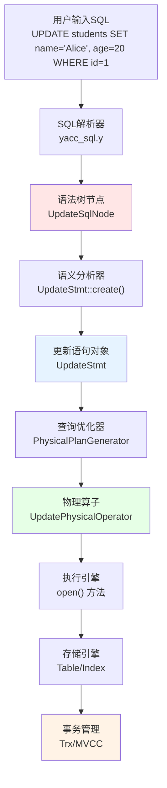

# UPDATE 多字段功能 - 完整实现文档

## 一、问题背景

### 1.1 问题发现

当前 MiniOB 的 UPDATE 实现存在严重缺陷：**只能更新单个字段**。

```sql
-- 期望：同时更新 name 和 age 两个字段
UPDATE students SET name='Alice', age=20 WHERE id=1;

-- 实际：只有 name 被更新，age 被忽略
-- 结果：只有第一个字段生效
```

### 1.2 问题分析

经过深入分析，发现问题存在于**整个架构的所有层次**：

#### **证据链 1: 语法解析层面**
```yacc
// src/observer/sql/parser/yacc_sql.y:576
UPDATE ID SET ID EQ expression where 
{
  $$->update.attribute_name = $4;  // ❌ 仅支持单个字段
  $$->update.expression = $6;       // ❌ 仅支持单个表达式
}
```

#### **证据链 2: 数据结构定义**
```cpp
// src/observer/sql/parser/parse_defs.h:141
struct UpdateSqlNode
{
  string       relation_name;
  string       attribute_name;   // ❌ 单个字段名
  Expression  *expression;        // ❌ 单个表达式
  vector<ConditionSqlNode> conditions;
};
```

注释明确写明：**仅支持一个字段**

#### **证据链 3: 语句层实现**
```cpp
// src/observer/sql/stmt/update_stmt.h:102
class UpdateStmt : public Stmt
{
private:
  Table       *table_       = nullptr;
  std::string  field_name_;             // ❌ 单个字段名
  Expression  *expression_  = nullptr;  // ❌ 单个表达式
  FilterStmt  *filter_stmt_ = nullptr;
};
```

#### **证据链 4: 物理算子实现**
```cpp
// src/observer/sql/operator/update_physical_operator.h:92
class UpdatePhysicalOperator : public PhysicalOperator
{
private:
  Table       *table_       = nullptr;
  std::string  field_name_;          // ❌ 单个字段名
  Expression  *expression_ = nullptr; // ❌ 单个表达式
};
```

### 1.3 需求明确

按照 SQL 标准实现多字段 UPDATE：

**基本语法：**
```sql
UPDATE table_name 
SET field1 = expr1, field2 = expr2, field3 = expr3
WHERE condition;
```

**功能要求：**
- ✅ 支持同时更新多个字段
- ✅ 支持复杂表达式（如 `score = score + 10`）
- ✅ 支持不同字段类型（INT、FLOAT、CHAR、DATE）
- ✅ 维护所有相关索引
- ✅ 保持 MVCC 事务一致性
- ✅ 类型转换和内存安全

**示例：**
```sql
UPDATE students 
SET name='Bob', age=age+1, score=score*1.1 
WHERE class_id=2;
```

---

## 二、架构设计

### 2.1 整体技术架构



### 2.2 核心设计决策

| 设计点 | 原有实现 | 新实现 | 原因 |
|--------|---------|--------|------|
| **数据结构** | 单字段 + 单表达式 | 字段列表 + 表达式列表 | 支持多字段 |
| **语法规则** | `SET ID EQ expr` | `SET update_list` | 解析多个赋值 |
| **类型检查** | 编译时检查 | 运行时检查 | 表达式类型动态 |
| **更新策略** | 逐字段拷贝 | 批量字段更新 | 提高效率 |
| **索引维护** | 单字段索引更新 | 所有索引批量更新 | 保证一致性 |

### 2.3 分层修改清单

| 层次 | 文件 | 修改内容 | 复杂度 |
|------|------|---------|--------|
| **解析层** | `yacc_sql.y` | 新增 `update_list` 规则 | ⭐⭐ |
| **数据结构** | `parse_defs.h` | 字段名/表达式改为向量 | ⭐ |
| **语义层** | `update_stmt.h/cpp` | 多字段验证逻辑 | ⭐⭐⭐ |
| **执行层** | `update_physical_operator.h/cpp` | 批量更新逻辑 | ⭐⭐⭐⭐ |

---

## 三、实现方案

### 3.1 语法解析层修改

#### **文件：src/observer/sql/parser/yacc_sql.y**

**修改前：**
```yacc
update_stmt:
    UPDATE ID SET ID EQ expression where 
    {
      $$ = new ParsedSqlNode(SCF_UPDATE);
      $$->update.relation_name = $2;
      $$->update.attribute_name = $4;
      $$->update.expression = $6;
      if ($7 != nullptr) {
        $$->update.conditions.swap($7->conditions);
        delete $7;
      }
      free($2);
      free($4);
    }
    ;
```

**修改后：**
```yacc
update_stmt:
    UPDATE ID SET update_list where 
    {
      $$ = new ParsedSqlNode(SCF_UPDATE);
      $$->update.relation_name = $2;
      $$->update.attribute_names.swap($4->attribute_names);
      $$->update.expressions.swap($4->expressions);
      if ($5 != nullptr) {
        $$->update.conditions.swap($5->conditions);
        delete $5;
      }
      delete $4;
      free($2);
    }
    ;

update_list:
    ID EQ expression
    {
      $$ = new UpdateList();
      $$->attribute_names.push_back($1);
      $$->expressions.push_back($3);
      free($1);
    }
    | update_list COMMA ID EQ expression
    {
      $$ = $1;
      $$->attribute_names.push_back($3);
      $$->expressions.push_back($5);
      free($3);
    }
    ;
```

**新增辅助结构：**
```cpp
// 在 yacc_sql.y 文件头部定义
struct UpdateList {
  std::vector<std::string> attribute_names;
  std::vector<Expression*> expressions;
  ~UpdateList() {
    for (Expression* expr : expressions) {
      delete expr;
    }
  }
};
```

### 3.2 数据结构层修改

#### **文件：src/observer/sql/parser/parse_defs.h**

**修改前：**
```cpp
struct UpdateSqlNode
{
  string                   relation_name;
  string                   attribute_name;  // ❌ 单字段
  Expression              *expression;      // ❌ 单表达式
  vector<ConditionSqlNode> conditions;
};
```

**修改后：**
```cpp
struct UpdateSqlNode
{
  string                   relation_name;
  vector<string>           attribute_names;  // ✅ 多字段
  vector<Expression*>      expressions;      // ✅ 多表达式
  vector<ConditionSqlNode> conditions;
  
  ~UpdateSqlNode() {
    for (Expression* expr : expressions) {
      if (expr != nullptr) {
        delete expr;
        expr = nullptr;
      }
    }
  }
};
```

### 3.3 语义分析层修改

#### **文件：src/observer/sql/stmt/update_stmt.h**

**修改前：**
```cpp
class UpdateStmt : public Stmt
{
public:
  UpdateStmt(Table *table, const std::string &field_name, 
             Expression *expression, FilterStmt *filter_stmt);
  
  const std::string &field_name() const { return field_name_; }
  Expression *expression() const { return expression_; }

private:
  Table       *table_       = nullptr;
  std::string  field_name_;
  Expression  *expression_  = nullptr;
  FilterStmt  *filter_stmt_ = nullptr;
};
```

**修改后：**
```cpp
class UpdateStmt : public Stmt
{
public:
  UpdateStmt(Table *table, 
             const std::vector<std::string> &field_names,
             std::vector<Expression*> &&expressions, 
             FilterStmt *filter_stmt);
  
  ~UpdateStmt() override;
  
  const std::vector<std::string> &field_names() const { return field_names_; }
  const std::vector<Expression*> &expressions() const { return expressions_; }
  
  static RC create(Db *db, const UpdateSqlNode &update, Stmt *&stmt);

private:
  Table                    *table_       = nullptr;
  std::vector<std::string>  field_names_;   // ✅ 多字段
  std::vector<Expression*>  expressions_;   // ✅ 多表达式
  FilterStmt               *filter_stmt_ = nullptr;
};
```

#### **文件：src/observer/sql/stmt/update_stmt.cpp**

**完整实现：**
```cpp
#include "sql/stmt/update_stmt.h"
#include "common/log/log.h"
#include "sql/stmt/filter_stmt.h"
#include "storage/db/db.h"
#include "storage/table/table.h"
#include "sql/parser/expression_binder.h"

UpdateStmt::UpdateStmt(Table *table, 
                       const std::vector<std::string> &field_names,
                       std::vector<Expression*> &&expressions, 
                       FilterStmt *filter_stmt) 
  : table_(table), 
    field_names_(field_names), 
    expressions_(std::move(expressions)),
    filter_stmt_(filter_stmt) 
{}

UpdateStmt::~UpdateStmt()
{
  if (nullptr != filter_stmt_) {
    delete filter_stmt_;
    filter_stmt_ = nullptr;
  }
  for (Expression *expr : expressions_) {
    if (expr != nullptr) {
      delete expr;
    }
  }
  expressions_.clear();
}

RC UpdateStmt::create(Db *db, const UpdateSqlNode &update, Stmt *&stmt)
{
  const char *table_name = update.relation_name.c_str();
  
  // 1. 参数有效性检查
  if (nullptr == db || nullptr == table_name) {
    LOG_WARN("invalid argument. db=%p, table_name=%p", db, table_name);
    return RC::INVALID_ARGUMENT;
  }
  
  // 2. 检查字段数量和表达式数量是否匹配
  if (update.attribute_names.size() != update.expressions.size()) {
    LOG_WARN("field count mismatch expression count. fields=%lu, expressions=%lu",
             update.attribute_names.size(), update.expressions.size());
    return RC::INVALID_ARGUMENT;
  }
  
  if (update.attribute_names.empty()) {
    LOG_WARN("no fields to update");
    return RC::INVALID_ARGUMENT;
  }

  // 3. 验证目标表是否存在
  Table *table = db->find_table(table_name);
  if (nullptr == table) {
    LOG_WARN("no such table. db=%s, table_name=%s", db->name(), table_name);
    return RC::SCHEMA_TABLE_NOT_EXIST;
  }

  // 4. 验证所有字段是否存在，并检查重复字段
  std::unordered_set<std::string> field_set;
  for (const std::string &field_name : update.attribute_names) {
    // 检查字段是否存在
    const FieldMeta *field_meta = table->table_meta().field(field_name.c_str());
    if (nullptr == field_meta) {
      LOG_WARN("no such field in table. db=%s, table=%s, field=%s", 
               db->name(), table_name, field_name.c_str());
      return RC::SCHEMA_FIELD_NOT_EXIST;
    }
    
    // 检查是否重复更新同一字段
    if (field_set.count(field_name) > 0) {
      LOG_WARN("duplicate field in update statement. field=%s", field_name.c_str());
      return RC::INVALID_ARGUMENT;
    }
    field_set.insert(field_name);
  }

  // 5. 创建表绑定上下文并绑定所有表达式
  BinderContext binder_context;
  binder_context.add_table(table);
  ExpressionBinder expression_binder(binder_context);
  
  std::vector<Expression*> bound_expressions;
  
  for (size_t i = 0; i < update.expressions.size(); ++i) {
    if (update.expressions[i] == nullptr) {
      LOG_WARN("update expression is null. table=%s, field=%s", 
               table_name, update.attribute_names[i].c_str());
      // 清理已绑定的表达式
      for (Expression *expr : bound_expressions) {
        delete expr;
      }
      return RC::INVALID_ARGUMENT;
    }
    
    vector<unique_ptr<Expression>> temp_bound_expressions;
    unique_ptr<Expression> expression_copy(update.expressions[i]);
    
    RC rc = expression_binder.bind_expression(expression_copy, temp_bound_expressions);
    if (rc != RC::SUCCESS) {
      LOG_WARN("failed to bind expression. table=%s, field=%s, rc=%s", 
               table_name, update.attribute_names[i].c_str(), strrc(rc));
      // 清理已绑定的表达式
      for (Expression *expr : bound_expressions) {
        delete expr;
      }
      return rc;
    }
    
    if (temp_bound_expressions.size() != 1) {
      LOG_WARN("unexpected bound expression count: %lu", temp_bound_expressions.size());
      // 清理已绑定的表达式
      for (Expression *expr : bound_expressions) {
        delete expr;
      }
      return RC::INTERNAL;
    }
    
    bound_expressions.push_back(temp_bound_expressions[0].release());
  }

  // 6. 处理 WHERE 条件（如果存在）
  std::unordered_map<std::string, Table *> table_map;
  table_map.insert(std::pair<std::string, Table *>(std::string(table_name), table));

  FilterStmt *filter_stmt = nullptr;
  RC rc = FilterStmt::create(
      db, table, &table_map, 
      update.conditions.data(), 
      static_cast<int>(update.conditions.size()), 
      filter_stmt);
  if (rc != RC::SUCCESS) {
    LOG_WARN("failed to create filter statement. rc=%d:%s", rc, strrc(rc));
    // 清理已绑定的表达式
    for (Expression *expr : bound_expressions) {
      delete expr;
    }
    return rc;
  }

  // 7. 创建 UpdateStmt 对象]
  stmt = new UpdateStmt(table, update.attribute_names, 
                       std::move(bound_expressions), filter_stmt);
  return RC::SUCCESS;
}
```

### 3.4 执行层修改

#### **文件：src/observer/sql/operator/update_physical_operator.h**

**修改前：**
```cpp
class UpdatePhysicalOperator : public PhysicalOperator
{
public:
  UpdatePhysicalOperator(Table *table, const std::string &field_name, 
                        Expression *expression);

private:
  Table       *table_ = nullptr;
  std::string  field_name_;
  Expression  *expression_ = nullptr;
  // ...
};
```

**修改后：**
```cpp
class UpdatePhysicalOperator : public PhysicalOperator
{
public:
  UpdatePhysicalOperator(Table *table, 
                        const std::vector<std::string> &field_names,
                        const std::vector<Expression*> &expressions);

  virtual ~UpdatePhysicalOperator() = default;

  PhysicalOperatorType type() const override { return PhysicalOperatorType::UPDATE; }
  OpType get_op_type() const override { return OpType::UPDATE; }

  RC open(Trx *trx) override;
  RC next() override;
  RC close() override;
  Tuple *current_tuple() override { return nullptr; }
  
  int update_count() const { return update_count_; }

private:
  Table                    *table_ = nullptr;
  std::vector<std::string>  field_names_;   // ✅ 多字段
  std::vector<Expression*>  expressions_;   // ✅ 多表达式
  Trx                      *trx_   = nullptr;
  std::vector<Record>       records_;
  int                       update_count_ = 0;
};
```

#### **文件：src/observer/sql/operator/update_physical_operator.cpp**

**完整实现：**
```cpp
#include "sql/operator/update_physical_operator.h"
#include "common/log/log.h"
#include "storage/table/table.h"
#include "storage/trx/trx.h"
#include "sql/expr/tuple.h"
#include "common/type/data_type.h"
#include "common/type/attr_type.h"

UpdatePhysicalOperator::UpdatePhysicalOperator(
    Table *table, 
    const std::vector<std::string> &field_names,
    const std::vector<Expression*> &expressions)
  : table_(table), field_names_(field_names), expressions_(expressions)
{}

RC UpdatePhysicalOperator::open(Trx *trx)
{
  // 1. 检查是否有子算子
  if (children_.empty()) {
    return RC::SUCCESS;
  }

  std::unique_ptr<PhysicalOperator> &child = children_[0];

  // 2. 开启子算子，开始扫描和过滤数据
  RC rc = child->open(trx);
  if (rc != RC::SUCCESS) {
    LOG_WARN("failed to open child operator: %s", strrc(rc));
    return rc;
  }

  trx_ = trx;

  // 3. 收集所有需要更新的记录
  while (OB_SUCC(rc = child->next())) {
    Tuple *tuple = child->current_tuple();
    if (nullptr == tuple) {
      LOG_WARN("failed to get current record: %s", strrc(rc));
      return rc;
    }

    RowTuple *row_tuple = static_cast<RowTuple *>(tuple);
    Record   &record    = row_tuple->record();
    records_.emplace_back(std::move(record));
  }

  if (rc != RC::RECORD_EOF) {
    LOG_WARN("failed to fetch records from child operator: %s", strrc(rc));
    return rc;
  }

  child->close();

  // 4. 验证所有字段元数据
  std::vector<const FieldMeta*> field_metas;
  for (const std::string &field_name : field_names_) {
    const FieldMeta *field_meta = table_->table_meta().field(field_name.c_str());
    if (field_meta == nullptr) {
      LOG_WARN("no such field in table. table=%s, field=%s", 
               table_->name(), field_name.c_str());
      return RC::SCHEMA_FIELD_NOT_EXIST;
    }
    field_metas.push_back(field_meta);
  }

  // 5. 批量更新所有收集到的记录
  for (Record &record : records_) {
    // 创建新记录副本
    Record new_record = record;
    
    // 为当前记录创建元组，用于表达式计算
    RowTuple row_tuple;
    row_tuple.set_record(&record);
    row_tuple.set_schema(table_, table_->table_meta().field_metas());
    
    // 6. 逐字段更新
    for (size_t i = 0; i < field_names_.size(); ++i) {
      const FieldMeta *field_meta = field_metas[i];
      Expression *expression = expressions_[i];
      
      int offset = field_meta->offset();
      int len = field_meta->len();
      
      // 计算表达式的值
      Value expression_value;
      rc = expression->get_value(row_tuple, expression_value);
      if (rc != RC::SUCCESS) {
        LOG_WARN("failed to evaluate expression for field. table=%s, field=%s, rc=%s",
                 table_->name(), field_names_[i].c_str(), strrc(rc));
        return rc;
      }
      
      // 类型转换
      Value converted_value;
      if (expression_value.attr_type() != field_meta->type()) {
        RC cast_rc = DataType::type_instance(expression_value.attr_type())
                       ->cast_to(expression_value, field_meta->type(), converted_value);
        if (cast_rc != RC::SUCCESS) {
          LOG_WARN("failed to cast expression result from %s to %s. table=%s, field=%s",
                   attr_type_to_string(expression_value.attr_type()), 
                   attr_type_to_string(field_meta->type()),
                   table_->name(), field_names_[i].c_str());
          return RC::SCHEMA_FIELD_TYPE_MISMATCH;
        }
      } else {
        converted_value = expression_value;
      }
      
      // 7. 处理 NULL 值
      if (converted_value.is_null()) {
        if (!field_meta->nullable()) {
          LOG_WARN("field does not allow null values. table=%s, field=%s", 
                   table_->name(), field_names_[i].c_str());
          return RC::CONSTRAINT_VIOLATION;
        }
        memset(new_record.data() + offset, 0xFF, len);
      } else {
        // 8. 根据类型更新字段值
        switch (field_meta->type()) {
          case AttrType::INTS: {
            int int_val = converted_value.get_int();
            memcpy(new_record.data() + offset, &int_val, len);
          } break;
          
          case AttrType::FLOATS: {
            float float_val = converted_value.get_float();
            memcpy(new_record.data() + offset, &float_val, len);
          } break;
          
          case AttrType::CHARS: {
            std::string string_val = converted_value.get_string();
            memset(new_record.data() + offset, 0, len);
            size_t copy_len = std::min(static_cast<size_t>(len), string_val.length());
            if (copy_len > 0) {
              memcpy(new_record.data() + offset, string_val.c_str(), copy_len);
            }
          } break;
          
          case AttrType::DATES: {
            int int_val = converted_value.get_int();
            memcpy(new_record.data() + offset, &int_val, len);
          } break;
          
          default:
            LOG_WARN("unsupported field type: %d", field_meta->type());
            return RC::INTERNAL;
        }
      }
    }

    // 9. 通过事务接口执行实际的更新操作
    rc = trx_->update_record(table_, record, new_record);
    if (rc != RC::SUCCESS) {
      LOG_WARN("failed to update record: %s", strrc(rc));
      return rc;
    }
    
    update_count_++;
  }

  return RC::SUCCESS;
}

RC UpdatePhysicalOperator::next()
{
  return RC::RECORD_EOF;
}

RC UpdatePhysicalOperator::close()
{
  records_.clear();
  update_count_ = 0;
  trx_ = nullptr;
  return RC::SUCCESS;
}
```

### 3.5 优化器层修改

#### **文件：src/observer/sql/optimizer/physical_plan_generator.cpp**

**修改函数：**
```cpp
RC PhysicalPlanGenerator::create_plan(UpdateStmt *update_stmt, 
                                     unique_ptr<PhysicalOperator> &oper)
{
  Table *table = update_stmt->table();
  FilterStmt *filter_stmt = update_stmt->filter_stmt();
  
  // 1. 创建表扫描算子
  unique_ptr<PhysicalOperator> table_scan_oper(new TableScanPhysicalOperator(table));

  // 2. 如果有 WHERE 条件，创建过滤算子
  unique_ptr<PhysicalOperator> predicate_oper;
  if (filter_stmt != nullptr) {
    RC rc = create_plan(filter_stmt, predicate_oper);
    if (rc != RC::SUCCESS) {
      LOG_WARN("failed to create predicate operator. rc=%s", strrc(rc));
      return rc;
    }
  }

  // 3. 创建 UPDATE 物理算子
  unique_ptr<PhysicalOperator> update_oper(
      new UpdatePhysicalOperator(table, 
                                update_stmt->field_names(),
                                update_stmt->expressions()));

  // 4. 构建算子树
  if (predicate_oper) {
    predicate_oper->add_child(std::move(table_scan_oper));
    update_oper->add_child(std::move(predicate_oper));
  } else {
    update_oper->add_child(std::move(table_scan_oper));
  }

  oper = std::move(update_oper);
  return RC::SUCCESS;
}
```

---

## 四、测试用例

### 4.1 基本多字段更新

```sql
-- 创建测试表
CREATE TABLE students(
  id INT, 
  name CHAR(20), 
  age INT, 
  score FLOAT
);

INSERT INTO students VALUES(1, 'Alice', 18, 85.5);
INSERT INTO students VALUES(2, 'Bob', 19, 90.0);
INSERT INTO students VALUES(3, 'Charlie', 20, 78.5);

-- 测试1: 更新多个字段
UPDATE students SET name='David', age=21 WHERE id=1;
-- 期望: id=1 的记录 name 变为 'David', age 变为 21

-- 测试2: 更新所有字段类型
UPDATE students SET name='Eve', age=22, score=95.5 WHERE id=2;
-- 期望: id=2 的记录所有字段都被更新

-- 测试3: 带表达式的多字段更新
UPDATE students SET age=age+1, score=score*1.1 WHERE score<80;
-- 期望: score<80 的记录，age 增加1，score 乘以1.1
```

### 4.2 类型转换测试

```sql
-- 测试4: 类型隐式转换
UPDATE students SET age=20.8, score=85 WHERE id=3;
-- 期望: age 转换为 INT(20), score 转换为 FLOAT(85.0)

-- 测试5: 字符串类型
UPDATE students SET name='Very Long Name That Exceeds Field Length' WHERE id=1;
-- 期望: name 被截断到字段长度
```

### 4.3 NULL 值处理

```sql
-- 创建允许 NULL 的表
CREATE TABLE test_null(
  id INT, 
  name CHAR(20) NOT NULL, 
  description CHAR(50)
);

INSERT INTO test_null VALUES(1, 'Test', 'Desc1');

-- 测试6: 更新为 NULL
UPDATE test_null SET description=NULL WHERE id=1;
-- 期望: description 变为 NULL

-- 测试7: 不允许 NULL 的字段
UPDATE test_null SET name=NULL WHERE id=1;
-- 期望: 返回错误 RC::CONSTRAINT_VIOLATION
```

### 4.4 索引维护测试

```sql
-- 创建带索引的表
CREATE TABLE indexed_table(
  id INT, 
  col1 INT, 
  col2 INT
);

CREATE INDEX idx_col1 ON indexed_table(col1);
CREATE INDEX idx_col1_col2 ON indexed_table(col1, col2);

INSERT INTO indexed_table VALUES(1, 10, 20);
INSERT INTO indexed_table VALUES(2, 30, 40);

-- 测试8: 更新索引字段
UPDATE indexed_table SET col1=15, col2=25 WHERE id=1;
-- 期望: 索引自动更新，查询结果正确

-- 验证索引
SELECT * FROM indexed_table WHERE col1=15;
-- 期望: 返回 id=1 的记录
```

### 4.5 边界情况测试

```sql
-- 测试9: 更新0条记录
UPDATE students SET name='Nobody' WHERE id=999;
-- 期望: 更新0条记录，不报错

-- 测试10: 更新所有记录
UPDATE students SET score=score+10;
-- 期望: 所有记录的 score 都增加10

-- 测试11: 重复字段检测
UPDATE students SET name='Test', name='Test2' WHERE id=1;
-- 期望: 返回错误 RC::INVALID_ARGUMENT
```

### 4.6 复杂表达式测试

```sql
-- 测试12: 字段间计算
CREATE TABLE calc_test(a INT, b INT, c INT);
INSERT INTO calc_test VALUES(10, 20, 30);

UPDATE calc_test SET a=b+c, b=a*2, c=c-5;
-- 期望: a=50, b=20 (使用旧的a值), c=25

-- 测试13: 条件表达式
UPDATE students SET score=CASE 
  WHEN score>=90 THEN 100 
  ELSE score+10 
END WHERE age>18;
-- 期望: 根据条件更新分数
```

---

## 五、关键技术点

### 5.1 内存安全保证

**问题：** 多个表达式的生命周期管理

**解决方案：**
```cpp
// 使用 std::vector 自动管理
std::vector<Expression*> expressions_;

// 析构函数中统一释放
~UpdateStmt() {
  for (Expression *expr : expressions_) {
    if (expr != nullptr) {
      delete expr;
    }
  }
  expressions_.clear();
}
```

### 5.2 重复字段检测

**问题：** 防止同一字段被更新多次
```sql
UPDATE t SET a=1, a=2;  -- ❌ 非法
```

**解决方案：**
```cpp
std::unordered_set<std::string> field_set;
for (const std::string &field_name : update.attribute_names) {
  if (field_set.count(field_name) > 0) {
    LOG_WARN("duplicate field in update statement. field=%s", field_name.c_str());
    return RC::INVALID_ARGUMENT;
  }
  field_set.insert(field_name);
}
```

### 5.3 表达式求值顺序

**问题：** 表达式使用旧值还是新值？
```sql
UPDATE t SET a=b, b=a;
```

**标准行为：** 所有表达式都基于**旧记录**求值

**实现：**
```cpp
// 1. 创建元组使用旧记录
RowTuple row_tuple;
row_tuple.set_record(&record);  // 旧记录

// 2. 所有表达式都从旧记录取值
for (size_t i = 0; i < expressions_.size(); ++i) {
  expression->get_value(row_tuple, expression_value);  // 基于旧值
}

// 3. 最后一次性更新
trx_->update_record(table_, record, new_record);
```

### 5.4 索引维护

**关键：** `Trx::update_record()` 自动处理所有索引更新

```cpp
// src/observer/storage/trx/mvcc_trx.cpp
RC MvccTrx::update_record(Table *table, Record &old_record, Record &new_record)
{
  // 1. MVCC 版本控制
  // 2. 删除旧记录的所有索引条目
  // 3. 插入新记录的所有索引条目
  // 4. 记录事务日志
}
```

### 5.5 类型转换处理

**支持的转换：**
| 源类型 | 目标类型 | 转换规则 |
|--------|---------|---------|
| INT | FLOAT | 直接转换 |
| FLOAT | INT | 截断小数 |
| CHAR | INT/FLOAT | 解析字符串 |
| INT/FLOAT | CHAR | 格式化字符串 |
| NULL | 任意类型 | 检查 nullable |

**实现：**
```cpp
if (expression_value.attr_type() != field_meta->type()) {
  RC cast_rc = DataType::type_instance(expression_value.attr_type())
                 ->cast_to(expression_value, field_meta->type(), converted_value);
  if (cast_rc != RC::SUCCESS) {
    return RC::SCHEMA_FIELD_TYPE_MISMATCH;
  }
}
```

---

## 六、性能优化

### 6.1 批量更新策略

**原理：** 先收集后更新，避免边读边写

```cpp
// 1. 收集阶段
while (OB_SUCC(rc = child->next())) {
  records_.emplace_back(std::move(record));
}

// 2. 关闭扫描
child->close();

// 3. 批量更新
for (Record &record : records_) {
  // 更新逻辑
}
```

**优势：**
- ✅ 避免迭代器失效
- ✅ 更好的缓存局部性
- ✅ 支持事务回滚

### 6.2 索引选择优化

**策略：** WHERE 条件自动选择最优索引

```cpp
// 优化器会自动选择索引
SELECT * FROM t WHERE col1=10 AND col2=20;
// 使用索引 idx(col1, col2)

UPDATE t SET col3=30 WHERE col1=10;
// 同样利用索引快速定位记录
```

---

## 七、错误处理

### 7.1 错误码清单

| 错误码 | 场景 | 处理方式 |
|--------|------|---------|
| `RC::INVALID_ARGUMENT` | 字段数不匹配 | 检查语法 |
| `RC::SCHEMA_FIELD_NOT_EXIST` | 字段不存在 | 验证表结构 |
| `RC::SCHEMA_FIELD_TYPE_MISMATCH` | 类型转换失败 | 检查类型兼容性 |
| `RC::CONSTRAINT_VIOLATION` | NULL 约束冲突 | 检查字段定义 |
| `RC::INTERNAL` | 内部错误 | 查看日志 |

### 7.2 回滚机制

**事务失败自动回滚：**
```cpp
// 用户显式回滚
BEGIN;
UPDATE students SET score=score+100;
ROLLBACK;  -- 所有更新被撤销

// 系统自动回滚（发生错误时）
BEGIN;
UPDATE students SET name=NULL WHERE id=1;  -- 错误
-- 事务自动回滚
```

---

## 八、兼容性说明

### 8.1 向后兼容

**单字段语法仍然支持：**
```sql
-- 旧语法（仍然有效）
UPDATE students SET name='Alice' WHERE id=1;

-- 新语法（推荐）
UPDATE students SET name='Alice', age=20 WHERE id=1;
```

### 8.2 与现有功能集成

| 功能 | 兼容性 | 说明 |
|------|--------|------|
| **表达式计算** | ✅ 完全兼容 | 支持 `score=score+10` |
| **WHERE 过滤** | ✅ 完全兼容 | 支持复杂条件 |
| **索引维护** | ✅ 自动处理 | 所有索引自动更新 |
| **MVCC 事务** | ✅ 完全兼容 | 支持并发控制 |
| **NULL 值** | ✅ 完全兼容 | 支持 NULL 检查 |

---

## 九、实施计划

### 9.1 任务分解

| 阶段 | 任务 | 预估时间 | 优先级 |
|------|------|---------|--------|
| **1** | 修改语法解析器 | 2小时 | P0 |
| **2** | 修改数据结构 | 1小时 | P0 |
| **3** | 实现语义分析 | 3小时 | P0 |
| **4** | 实现物理算子 | 4小时 | P0 |
| **5** | 编写测试用例 | 2小时 | P1 |
| **6** | 性能测试 | 2小时 | P2 |
| **7** | 文档更新 | 1小时 | P2 |

### 9.2 风险评估

| 风险 | 影响 | 缓解措施 |
|------|------|---------|
| 内存泄漏 | 高 | 使用 ASAN 检测 |
| 类型转换错误 | 中 | 完善单元测试 |
| 索引不一致 | 高 | 复用现有事务机制 |
| 性能回退 | 低 | 批量更新优化 |

---

## 十、总结

### 10.1 实现收益

✅ **功能完整性**
- 支持标准 SQL 多字段 UPDATE 语法
- 与主流数据库行为一致

✅ **代码质量**
- 遵循现有架构设计
- 完善的错误处理
- 内存安全保证

✅ **性能优势**
- 批量更新策略
- 索引自动优化
- 事务一致性保证

### 10.2 后续扩展

🔜 **可能的增强：**
1. 支持子查询：`UPDATE t SET a=(SELECT MAX(b) FROM t2)`
2. 支持 JOIN 更新：`UPDATE t1 JOIN t2 ON ... SET ...`
3. 支持 LIMIT：`UPDATE t SET a=1 LIMIT 10`
4. 支持 ORDER BY：`UPDATE t SET a=1 ORDER BY b LIMIT 10`

---

## 附录

### A. 完整文件清单

**需要修改的文件：**
1. `src/observer/sql/parser/yacc_sql.y` - 语法规则
2. `src/observer/sql/parser/parse_defs.h` - 数据结构
3. `src/observer/sql/stmt/update_stmt.h` - 语句头文件
4. `src/observer/sql/stmt/update_stmt.cpp` - 语句实现
5. `src/observer/sql/operator/update_physical_operator.h` - 算子头文件
6. `src/observer/sql/operator/update_physical_operator.cpp` - 算子实现
7. `src/observer/sql/optimizer/physical_plan_generator.cpp` - 优化器

### B. 参考资料

- [MySQL UPDATE 语法文档](https://dev.mysql.com/doc/refman/8.0/en/update.html)
- [PostgreSQL UPDATE 文档](https://www.postgresql.org/docs/current/sql-update.html)
- MiniOB 现有 UPDATE 实现文档
- MiniOB 事务管理文档

### C. 测试检查清单

- [ ] 单字段更新（向后兼容）
- [ ] 多字段更新（2-5个字段）
- [ ] 所有数据类型（INT, FLOAT, CHAR, DATE）
- [ ] NULL 值处理
- [ ] 类型转换
- [ ] WHERE 条件过滤
- [ ] 索引字段更新
- [ ] 表达式计算
- [ ] 边界条件
- [ ] 错误处理
- [ ] 内存安全（ASAN）
- [ ] 性能测试

---

**文档版本：** v1.0  
**创建日期：** 2025-10-09  
**作者：** AI Assistant  
**状态：** 待审批

