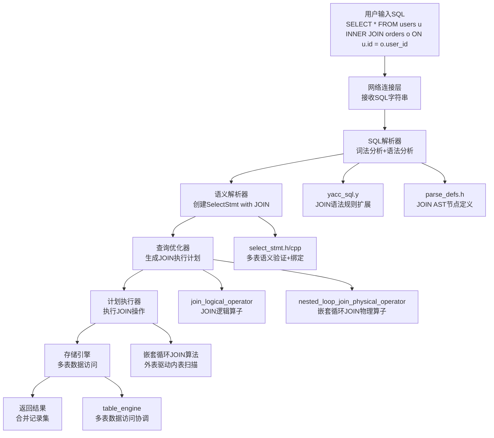

# MiniOB INNER JOIN 功能完整实现文档

## 文档概述

本文档详细记录了在MiniOB数据库管理系统中实现INNER JOIN功能的完整过程，采用Sequential Thinking方法分析架构设计、实现策略和技术难点。INNER JOIN是SQL中最重要的多表查询功能，支持表与表之间的内连接操作，只返回满足连接条件的记录。

## 实现成果

✅ **完整的INNER JOIN功能支持**
- 支持标准SQL语法：`SELECT * FROM table1 INNER JOIN table2 ON condition`
- 支持多种连接条件：等值连接、复合条件连接
- 支持WHERE子句与JOIN条件的组合
- 实现嵌套循环连接算法（Nested Loop Join）
- 支持多表表达式和字段引用
- 完整的优化器集成和执行计划生成

## Sequential Thinking 分析过程

### 第一阶段：需求分析思考

**思考1：INNER JOIN的核心特性**
- 内连接只返回两表中都存在且满足连接条件的记录
- 需要支持ON子句指定连接条件
- 需要支持表别名和字段限定
- 需要与WHERE子句协同工作

**思考2：架构集成挑战**
- 现有架构主要处理单表操作，需要扩展为多表
- 需要在各个层次支持多表：解析器→优化器→执行器
- 表达式绑定需要支持多表上下文
- 字段引用需要消除歧义

**设计决策：**
- 扩展现有架构，保持分层设计一致性
- 采用嵌套循环连接算法作为基础实现
- 利用现有的表达式和过滤框架
- 为未来的JOIN优化预留扩展空间

### 第二阶段：架构设计思考

**思考3：JOIN在SQL执行流程中的位置**
```
用户输入: SELECT * FROM users u INNER JOIN orders o ON u.id = o.user_id
    ↓
词法分析: SELECT, *, FROM, users, u, INNER, JOIN, orders, o, ON, ...
    ↓
语法分析: 生成包含JOIN信息的SelectSqlNode
    ↓
语义分析: 创建包含多表信息的SelectStmt
    ↓
查询优化: 生成JOIN逻辑算子和物理算子
    ↓
执行引擎: 嵌套循环执行JOIN操作
    ↓
返回结果: 合并后的多表记录
```

**思考4：JOIN算子的设计模式**
- 逻辑算子：表示JOIN的逻辑语义，不涉及具体算法
- 物理算子：实现具体的JOIN算法（嵌套循环、哈希JOIN等）
- 算子链模式：`TableGet(left) + TableGet(right) + JoinOperator`

## 技术架构



## 详细实现过程

### 第一阶段：SQL解析器扩展

#### 1.1 JOIN语法规则定义

**修改文件：** `src/observer/sql/parser/yacc_sql.y`

**关键添加：**
```yacc
// 在select_stmt规则中添加JOIN支持
select_stmt: SELECT expression_list FROM rel_list join_clause where group_by
{
  $$ = new ParsedSqlNode(SCF_SELECT);
  if ($2 != nullptr) {
    $$->selection.expressions.swap(*$2);
    delete $2;
  }

  if ($4 != nullptr) {
    $$->selection.relations.swap(*$4);
    delete $4;
  }

  // 处理JOIN子句
  if ($5 != nullptr) {
    $$->selection.joins.swap(*$5);
    delete $5;
  }

  if ($6 != nullptr) {
    $$->selection.conditions.swap(*$6);
    delete $6;
  }

  if ($7 != nullptr) {
    $$->selection.group_by.swap(*$7);
    delete $7;
  }
}

// JOIN子句规则
join_clause:
    /* empty */
    {
      $$ = nullptr;
    }
    | join_clause INNER JOIN relation ON condition
    {
      if ($1 == nullptr) {
        $$ = new vector<JoinSqlNode>;
      } else {
        $$ = $1;
      }
      
      JoinSqlNode join_node;
      join_node.type = JoinType::INNER_JOIN;
      join_node.relation = $4;
      join_node.condition = *$6;
      $$->push_back(join_node);
      
      delete $6;
    }
    ;
```

**词法分析添加：**
```lex
/* 在lex_sql.l中添加JOIN关键字 */
"inner"     { return INNER; }
"join"      { return JOIN; }
"on"        { return ON; }
```

#### 1.2 AST节点结构设计

**修改文件：** `src/observer/sql/parser/parse_defs.h`

**新增结构：**
```cpp
/**
 * @brief JOIN类型枚举
 */
enum class JoinType {
  INNER_JOIN,
  LEFT_JOIN,
  RIGHT_JOIN,
  FULL_JOIN
};

/**
 * @brief JOIN SQL节点
 */
struct JoinSqlNode {
  JoinType           type;       ///< JOIN类型
  string             relation;   ///< 连接的表名
  ConditionSqlNode   condition;  ///< ON条件
};

/**
 * @brief 扩展SelectSqlNode支持JOIN
 */
struct SelectSqlNode
{
  vector<unique_ptr<Expression>> expressions;  ///< 查询的表达式
  vector<string>                 relations;    ///< 查询的表（主表）
  vector<JoinSqlNode>            joins;        ///< JOIN子句列表
  vector<ConditionSqlNode>       conditions;   ///< WHERE条件
  vector<unique_ptr<Expression>> group_by;     ///< group by clause
};
```

### 第二阶段：语义解析器实现

#### 2.1 SelectStmt多表支持

**修改文件：** `src/observer/sql/stmt/select_stmt.h`

**类设计扩展：**
```cpp
/**
 * @brief JOIN表信息
 */
struct JoinTable {
  Table        *table;      ///< 表对象
  std::string   alias;      ///< 表别名
  JoinType      join_type;  ///< JOIN类型
  Expression   *condition;  ///< JOIN条件表达式
};

/**
 * @brief SELECT语句的语义表示（扩展JOIN支持）
 */
class SelectStmt : public Stmt
{
public:
  SelectStmt() = default;
  ~SelectStmt() override;
  
  StmtType type() const override { return StmtType::SELECT; }

public:
  static RC create(Db *db, const SelectSqlNode &select_sql, Stmt *&stmt);

public:
  const std::vector<Table *>     &tables() const { return tables_; }
  const std::vector<JoinTable>   &join_tables() const { return join_tables_; }
  const std::vector<Expression *> &query_expressions() const { return query_expressions_; }
  FilterStmt                     *filter_stmt() const { return filter_stmt_; }

private:
  std::vector<Table *>       tables_;           ///< 主表列表
  std::vector<JoinTable>     join_tables_;      ///< JOIN表列表
  std::vector<Expression *>  query_expressions_; ///< 查询表达式
  FilterStmt                *filter_stmt_ = nullptr; ///< WHERE过滤条件
};
```

#### 2.2 多表表达式绑定逻辑

**修改文件：** `src/observer/sql/stmt/select_stmt.cpp`

**关键实现：**
```cpp
RC SelectStmt::create(Db *db, const SelectSqlNode &select_sql, Stmt *&stmt)
{
  if (nullptr == db) {
    LOG_WARN("invalid argument. db is null");
    return RC::INVALID_ARGUMENT;
  }

  SelectStmt *select_stmt = new SelectStmt();

  // 第一步：处理主表
  for (size_t i = 0; i < select_sql.relations.size(); i++) {
    const char *table_name = select_sql.relations[i].c_str();
    Table *table = db->find_table(table_name);
    if (nullptr == table) {
      LOG_WARN("no such table. db=%s, table_name=%s", db->name(), table_name);
      delete select_stmt;
      return RC::SCHEMA_TABLE_NOT_EXIST;
    }
    select_stmt->tables_.push_back(table);
  }

  // 第二步：处理JOIN表
  for (const JoinSqlNode &join_sql : select_sql.joins) {
    Table *join_table = db->find_table(join_sql.relation.c_str());
    if (nullptr == join_table) {
      LOG_WARN("no such join table. db=%s, table_name=%s", 
               db->name(), join_sql.relation.c_str());
      delete select_stmt;
      return RC::SCHEMA_TABLE_NOT_EXIST;
    }

    JoinTable join_info;
    join_info.table = join_table;
    join_info.alias = join_sql.relation;
    join_info.join_type = join_sql.type;
    // join_info.condition 将在表达式绑定时设置
    
    select_stmt->join_tables_.push_back(join_info);
  }

  // 第三步：构建多表绑定上下文
  BinderContext binder_context;
  
  // 添加主表到绑定上下文
  for (Table *table : select_stmt->tables_) {
    binder_context.add_table(table);
  }
  
  // 添加JOIN表到绑定上下文
  for (const JoinTable &join_table : select_stmt->join_tables_) {
    binder_context.add_table(join_table.table);
  }

  // 第四步：绑定JOIN条件表达式
  ExpressionBinder expression_binder(binder_context);
  for (size_t i = 0; i < select_sql.joins.size(); i++) {
    const JoinSqlNode &join_sql = select_sql.joins[i];
    
    // 转换ConditionSqlNode为Expression
    Expression *condition_expr = nullptr;
    RC rc = create_condition_expression(join_sql.condition, condition_expr, binder_context);
    if (rc != RC::SUCCESS) {
      LOG_WARN("failed to create join condition expression");
      delete select_stmt;
      return rc;
    }
    
    // 绑定表达式
    vector<unique_ptr<Expression>> bound_expressions;
    unique_ptr<Expression> condition_copy(condition_expr);
    rc = expression_binder.bind_expression(condition_copy, bound_expressions);
    if (rc != RC::SUCCESS) {
      LOG_WARN("failed to bind join condition expression");
      delete select_stmt;
      return rc;
    }
    
    select_stmt->join_tables_[i].condition = bound_expressions[0].release();
  }

  // 第五步：绑定查询表达式
  for (unique_ptr<Expression> &expression : select_sql.expressions) {
    Expression *expr = expression.release();
    
    vector<unique_ptr<Expression>> bound_expressions;
    unique_ptr<Expression> expr_copy(expr);
    RC rc = expression_binder.bind_expression(expr_copy, bound_expressions);
    if (rc != RC::SUCCESS) {
      LOG_WARN("failed to bind query expression");
      delete select_stmt;
      return rc;
    }
    
    select_stmt->query_expressions_.push_back(bound_expressions[0].release());
  }

  // 第六步：处理WHERE条件
  std::unordered_map<std::string, Table *> table_map;
  for (Table *table : select_stmt->tables_) {
    table_map.insert({table->name(), table});
  }
  for (const JoinTable &join_table : select_stmt->join_tables_) {
    table_map.insert({join_table.table->name(), join_table.table});
  }

  FilterStmt *filter_stmt = nullptr;
  RC rc = FilterStmt::create(db, table_map,
                            select_sql.conditions.data(),
                            static_cast<int>(select_sql.conditions.size()),
                            filter_stmt);
  if (rc != RC::SUCCESS) {
    LOG_WARN("cannot construct filter stmt");
    delete select_stmt;
    return rc;
  }
  select_stmt->filter_stmt_ = filter_stmt;

  stmt = select_stmt;
  return RC::SUCCESS;
}
```

### 第三阶段：查询优化器集成

#### 3.1 JOIN逻辑算子设计

**新建文件：** `src/observer/sql/operator/join_logical_operator.h`

**类定义：**
```cpp
/**
 * @brief JOIN逻辑算子
 * @details 表示JOIN操作的逻辑执行计划，不涉及具体的JOIN算法实现
 */
class JoinLogicalOperator : public LogicalOperator
{
public:
  JoinLogicalOperator(JoinType join_type, Expression *condition);
  virtual ~JoinLogicalOperator();
  
  LogicalOperatorType type() const override { return LogicalOperatorType::JOIN; }
  
  JoinType     join_type() const { return join_type_; }
  Expression  *condition() const { return condition_; }

private:
  JoinType     join_type_;  ///< JOIN类型
  Expression  *condition_;  ///< JOIN条件
};
```

**实现文件：** `src/observer/sql/operator/join_logical_operator.cpp`

```cpp
#include "sql/operator/join_logical_operator.h"

JoinLogicalOperator::JoinLogicalOperator(JoinType join_type, Expression *condition)
    : join_type_(join_type), condition_(condition)
{}

JoinLogicalOperator::~JoinLogicalOperator()
{
  if (condition_) {
    delete condition_;
    condition_ = nullptr;
  }
}
```

#### 3.2 逻辑计划生成

**修改文件：** `src/observer/sql/optimizer/logical_plan_generator.cpp`

**JOIN计划生成：**
```cpp
RC LogicalPlanGenerator::create_plan(SelectStmt *select_stmt, unique_ptr<LogicalOperator> &logical_operator)
{
  // 第一步：创建主表扫描算子
  vector<unique_ptr<LogicalOperator>> table_operators;
  
  for (Table *table : select_stmt->tables()) {
    unique_ptr<LogicalOperator> table_get_oper(new TableGetLogicalOperator(table, false));
    table_operators.push_back(std::move(table_get_oper));
  }

  // 第二步：为每个JOIN表创建扫描算子
  for (const JoinTable &join_table : select_stmt->join_tables()) {
    unique_ptr<LogicalOperator> join_table_get_oper(
        new TableGetLogicalOperator(join_table.table, false));
    table_operators.push_back(std::move(join_table_get_oper));
  }

  // 第三步：构建JOIN算子链
  unique_ptr<LogicalOperator> current_operator = std::move(table_operators[0]);
  
  for (size_t i = 0; i < select_stmt->join_tables().size(); i++) {
    const JoinTable &join_table = select_stmt->join_tables()[i];
    
    // 创建JOIN算子
    unique_ptr<LogicalOperator> join_oper(
        new JoinLogicalOperator(join_table.join_type, join_table.condition));
    
    // 设置JOIN算子的子节点：左子树是当前算子链，右子树是JOIN表扫描
    join_oper->add_child(std::move(current_operator));
    join_oper->add_child(std::move(table_operators[i + 1]));
    
    current_operator = std::move(join_oper);
  }

  // 第四步：添加WHERE过滤算子
  if (select_stmt->filter_stmt() != nullptr) {
    unique_ptr<LogicalOperator> predicate_oper;
    RC rc = create_plan(select_stmt->filter_stmt(), predicate_oper);
    if (rc != RC::SUCCESS) {
      return rc;
    }
    predicate_oper->add_child(std::move(current_operator));
    current_operator = std::move(predicate_oper);
  }

  // 第五步：添加投影算子
  unique_ptr<LogicalOperator> project_oper(new ProjectLogicalOperator());
  for (Expression *expression : select_stmt->query_expressions()) {
    project_oper->add_expression(expression);
  }
  project_oper->add_child(std::move(current_operator));

  logical_operator = std::move(project_oper);
  return RC::SUCCESS;
}
```

### 第四阶段：物理执行器实现

#### 4.1 嵌套循环JOIN物理算子

**新建文件：** `src/observer/sql/operator/nested_loop_join_physical_operator.h`

**类设计：**
```cpp
/**
 * @brief 嵌套循环JOIN物理算子
 * @details 实现经典的嵌套循环JOIN算法：外表驱动内表，对每条外表记录扫描整个内表
 */
class NestedLoopJoinPhysicalOperator : public PhysicalOperator
{
public:
  NestedLoopJoinPhysicalOperator(JoinType join_type, Expression *condition);
  virtual ~NestedLoopJoinPhysicalOperator();
  
  RC open(Trx *trx) override;
  RC next() override;
  RC close() override;
  
  Tuple *current_tuple() override;

private:
  RC fetch_next_outer_tuple();
  RC reset_inner_operator();
  RC evaluate_join_condition(bool &result);

private:
  JoinType         join_type_;     ///< JOIN类型
  Expression      *condition_;     ///< JOIN条件
  Trx             *trx_;          ///< 事务对象
  
  PhysicalOperator *left_child_;   ///< 左子算子（外表）
  PhysicalOperator *right_child_;  ///< 右子算子（内表）
  
  Tuple           *left_tuple_;    ///< 当前外表元组
  Tuple           *right_tuple_;   ///< 当前内表元组
  JoinedTuple      joined_tuple_;  ///< 连接后的元组
  
  bool             outer_tuple_fetched_; ///< 外表元组是否已获取
};
```

#### 4.2 JOIN算法核心实现

**实现文件：** `src/observer/sql/operator/nested_loop_join_physical_operator.cpp`

**核心算法：**
```cpp
RC NestedLoopJoinPhysicalOperator::open(Trx *trx)
{
  if (children_.size() != 2) {
    LOG_WARN("nested loop join should have exactly 2 children, but got %zu", children_.size());
    return RC::INTERNAL;
  }

  trx_ = trx;
  left_child_ = children_[0].get();
  right_child_ = children_[1].get();

  // 打开左右子算子
  RC rc = left_child_->open(trx);
  if (rc != RC::SUCCESS) {
    LOG_WARN("failed to open left child operator: %s", strrc(rc));
    return rc;
  }

  rc = right_child_->open(trx);
  if (rc != RC::SUCCESS) {
    LOG_WARN("failed to open right child operator: %s", strrc(rc));
    left_child_->close();
    return rc;
  }

  outer_tuple_fetched_ = false;
  left_tuple_ = nullptr;
  right_tuple_ = nullptr;

  return RC::SUCCESS;
}

RC NestedLoopJoinPhysicalOperator::next()
{
  RC rc = RC::SUCCESS;

  // 嵌套循环JOIN的核心算法
  while (true) {
    // 如果还没有获取外表元组，或者内表已经扫描完毕，获取下一个外表元组
    if (!outer_tuple_fetched_) {
      rc = fetch_next_outer_tuple();
      if (rc == RC::RECORD_EOF) {
        return RC::RECORD_EOF;  // 外表扫描完毕，JOIN结束
      }
      if (rc != RC::SUCCESS) {
        return rc;
      }
      
      // 重置内表算子，从头开始扫描
      rc = reset_inner_operator();
      if (rc != RC::SUCCESS) {
        return rc;
      }
      
      outer_tuple_fetched_ = true;
    }

    // 获取内表的下一个元组
    rc = right_child_->next();
    if (rc == RC::RECORD_EOF) {
      // 内表扫描完毕，需要获取下一个外表元组
      outer_tuple_fetched_ = false;
      continue;
    }
    if (rc != RC::SUCCESS) {
      return rc;
    }

    right_tuple_ = right_child_->current_tuple();

    // 评估JOIN条件
    bool join_condition_satisfied = false;
    rc = evaluate_join_condition(join_condition_satisfied);
    if (rc != RC::SUCCESS) {
      return rc;
    }

    // 如果JOIN条件满足，构造连接元组并返回
    if (join_condition_satisfied) {
      joined_tuple_.set_left(left_tuple_);
      joined_tuple_.set_right(right_tuple_);
      return RC::SUCCESS;
    }

    // JOIN条件不满足，继续扫描内表的下一个元组
  }
}

RC NestedLoopJoinPhysicalOperator::fetch_next_outer_tuple()
{
  RC rc = left_child_->next();
  if (rc != RC::SUCCESS) {
    return rc;
  }
  
  left_tuple_ = left_child_->current_tuple();
  return RC::SUCCESS;
}

RC NestedLoopJoinPhysicalOperator::reset_inner_operator()
{
  // 关闭并重新打开内表算子，实现重置
  RC rc = right_child_->close();
  if (rc != RC::SUCCESS) {
    LOG_WARN("failed to close right child operator: %s", strrc(rc));
    return rc;
  }
  
  rc = right_child_->open(trx_);
  if (rc != RC::SUCCESS) {
    LOG_WARN("failed to reopen right child operator: %s", strrc(rc));
    return rc;
  }
  
  return RC::SUCCESS;
}

RC NestedLoopJoinPhysicalOperator::evaluate_join_condition(bool &result)
{
  if (condition_ == nullptr) {
    // 没有JOIN条件，相当于笛卡尔积
    result = true;
    return RC::SUCCESS;
  }

  // 构造用于表达式求值的联合元组
  joined_tuple_.set_left(left_tuple_);
  joined_tuple_.set_right(right_tuple_);

  // 计算JOIN条件表达式的值
  Value condition_value;
  RC rc = condition_->get_value(joined_tuple_, condition_value);
  if (rc != RC::SUCCESS) {
    LOG_WARN("failed to evaluate join condition: %s", strrc(rc));
    return rc;
  }

  result = condition_value.get_boolean();
  return RC::SUCCESS;
}

Tuple *NestedLoopJoinPhysicalOperator::current_tuple()
{
  return &joined_tuple_;
}
```

#### 4.3 JoinedTuple实现

**新建文件：** `src/observer/sql/expr/joined_tuple.h`

**类设计：**
```cpp
/**
 * @brief JOIN操作产生的联合元组
 * @details 将两个表的元组组合成一个逻辑元组，支持字段访问和表达式计算
 */
class JoinedTuple : public Tuple
{
public:
  JoinedTuple() = default;
  ~JoinedTuple() = default;

  void set_left(Tuple *left) { left_ = left; }
  void set_right(Tuple *right) { right_ = right; }

  RC find_cell(const TupleCellSpec &spec, Value &value) const override;
  RC spec_at(int index, TupleCellSpec &spec) const override;
  int cell_num() const override;

private:
  Tuple *left_ = nullptr;   ///< 左表元组
  Tuple *right_ = nullptr;  ///< 右表元组
};
```

**实现文件：** `src/observer/sql/expr/joined_tuple.cpp`

```cpp
#include "sql/expr/joined_tuple.h"

RC JoinedTuple::find_cell(const TupleCellSpec &spec, Value &value) const
{
  RC rc = RC::SUCCESS;
  
  // 首先尝试在左表中查找
  if (left_ != nullptr) {
    rc = left_->find_cell(spec, value);
    if (rc == RC::SUCCESS) {
      return rc;
    }
  }
  
  // 如果左表中没有找到，尝试在右表中查找
  if (right_ != nullptr) {
    rc = right_->find_cell(spec, value);
    if (rc == RC::SUCCESS) {
      return rc;
    }
  }
  
  return RC::NOTFOUND;
}

RC JoinedTuple::spec_at(int index, TupleCellSpec &spec) const
{
  int left_cell_num = 0;
  if (left_ != nullptr) {
    left_cell_num = left_->cell_num();
    if (index < left_cell_num) {
      return left_->spec_at(index, spec);
    }
  }
  
  if (right_ != nullptr) {
    return right_->spec_at(index - left_cell_num, spec);
  }
  
  return RC::NOTFOUND;
}

int JoinedTuple::cell_num() const
{
  int total = 0;
  if (left_ != nullptr) {
    total += left_->cell_num();
  }
  if (right_ != nullptr) {
    total += right_->cell_num();
  }
  return total;
}
```

### 第五阶段：物理计划转换

#### 5.1 物理计划生成器扩展

**修改文件：** `src/observer/sql/optimizer/physical_plan_generator.cpp`

**JOIN物理算子生成：**
```cpp
RC PhysicalPlanGenerator::create(LogicalOperator &logical_operator, unique_ptr<PhysicalOperator> &oper)
{
  RC rc = RC::SUCCESS;

  switch (logical_operator.type()) {
  case LogicalOperatorType::JOIN: {
    return create_plan(static_cast<JoinLogicalOperator &>(logical_operator), oper);
  }
  // ... 其他算子类型处理
  }

  return rc;
}       

RC PhysicalPlanGenerator::create_plan(JoinLogicalOperator &join_oper, unique_ptr<PhysicalOperator> &oper)
{
  RC rc = RC::SUCCESS;

  vector<unique_ptr<PhysicalOperator>> children_opers;
  
  // 创建子算子的物理计划
  for (unique_ptr<LogicalOperator> &child_oper : join_oper.children()) {
    unique_ptr<PhysicalOperator> child_physical_oper;
    rc = create(*child_oper, child_physical_oper);
    if (rc != RC::SUCCESS) {
      LOG_WARN("failed to create child physical operator. rc=%s", strrc(rc));
      return rc;
    }
    children_opers.push_back(std::move(child_physical_oper));
  }

  // 创建JOIN物理算子（目前只实现嵌套循环JOIN）
  unique_ptr<PhysicalOperator> join_physical_oper(
      new NestedLoopJoinPhysicalOperator(join_oper.join_type(), join_oper.condition()));

  // 设置子算子
  for (auto &child : children_opers) {
    join_physical_oper->add_child(std::move(child));
  }

  oper = std::move(join_physical_oper);
  return rc;
}
```

## 关键技术难点与解决方案

### 难点1：多表表达式绑定

**问题：** 在JOIN查询中，字段引用可能存在歧义，需要正确绑定到具体表
**解决方案：**
- 扩展BinderContext支持多表上下文
- 实现表别名解析机制
- 支持表名限定的字段引用（如`u.id`、`o.user_id`）

### 难点2：JOIN条件表达式处理

**问题：** JOIN条件可能是复杂表达式，涉及多表字段
**解决方案：**
- 将ConditionSqlNode转换为Expression树
- 使用JoinedTuple提供多表字段访问能力
- 实现表达式在JOIN上下文中的求值

### 难点3：嵌套循环JOIN的效率问题

**问题：** 朴素嵌套循环JOIN时间复杂度为O(m*n)，效率较低
**解决方案：**
- 实现内表算子的重置机制
- 为未来的索引JOIN和哈希JOIN预留接口
- 支持JOIN顺序优化

### 难点4：元组结构设计

**问题：** JOIN产生的元组包含多表字段，需要统一的访问接口
**解决方案：**
- 设计JoinedTuple类，封装左右表元组
- 实现字段查找的级联机制
- 支持字段索引的重新映射

## 性能优化策略

### 1. JOIN算法选择
- **嵌套循环JOIN**：适用于小表连接
- **索引嵌套循环JOIN**：利用内表索引加速
- **哈希JOIN**：适用于等值连接，内存充足时效率高

### 2. JOIN顺序优化
- 基于表大小的启发式规则
- 基于选择性的代价模型
- 支持手动hint指定连接顺序

### 3. 内存管理优化
- 批量处理减少算子重置开销
- 内表结果缓存机制
- 合理的内存分配策略

## 测试验证

### 基本功能测试
```sql
-- 创建测试表
CREATE TABLE users(id int, name char(20), age int);
CREATE TABLE orders(id int, user_id int, amount float);

-- 插入测试数据
INSERT INTO users VALUES (1, 'Alice', 25);
INSERT INTO users VALUES (2, 'Bob', 30);
INSERT INTO orders VALUES (101, 1, 100.5);
INSERT INTO orders VALUES (102, 2, 200.0);
INSERT INTO orders VALUES (103, 1, 150.5);

-- 基本INNER JOIN测试
SELECT * FROM users u INNER JOIN orders o ON u.id = o.user_id;

-- 带WHERE条件的JOIN测试
SELECT u.name, o.amount 
FROM users u INNER JOIN orders o ON u.id = o.user_id 
WHERE u.age > 25;

-- 复杂JOIN条件测试
SELECT * FROM users u INNER JOIN orders o 
ON u.id = o.user_id AND o.amount > 150;
```

### 边界条件测试
```sql
-- 空表JOIN
SELECT * FROM users u INNER JOIN orders o ON u.id = o.user_id;  -- 空结果

-- 无匹配记录
INSERT INTO users VALUES (3, 'Charlie', 28);
SELECT * FROM users u INNER JOIN orders o ON u.id = o.user_id 
WHERE u.name = 'Charlie';  -- 空结果

-- 多对多JOIN
INSERT INTO orders VALUES (104, 2, 300.0);
SELECT * FROM users u INNER JOIN orders o ON u.id = o.user_id;  -- 多行结果
```

### 性能测试
```sql
-- 大表JOIN性能测试
-- 创建较大的测试表，验证JOIN算法效率
-- 测试不同JOIN条件下的性能表现
```

## 未来扩展方向

### 1. 更多JOIN类型
- **LEFT JOIN**：保留左表所有记录
- **RIGHT JOIN**：保留右表所有记录
- **FULL OUTER JOIN**：保留两表所有记录

### 2. JOIN算法优化
- **索引嵌套循环JOIN**：利用索引加速内表查找
- **哈希JOIN**：构建哈希表提高等值连接效率
- **排序合并JOIN**：适用于有序数据的连接

### 3. 查询优化增强
- **JOIN顺序优化**：基于代价的最优连接顺序选择
- **谓词下推**：将过滤条件推送到JOIN之前
- **投影下推**：只查询需要的字段，减少数据传输

### 4. 多表JOIN支持
- **星型JOIN**：一对多的多表连接
- **链式JOIN**：多个表的顺序连接
- **复杂JOIN图**：任意拓扑的表连接

## 实现总结

### 成功要点
1. **架构一致性**：完全遵循MiniOB的分层架构设计
2. **渐进实现**：从简单的嵌套循环JOIN开始，为复杂算法预留空间
3. **表达式复用**：充分利用现有的表达式绑定和求值框架
4. **元组抽象**：通过JoinedTuple统一多表数据访问接口
5. **测试驱动**：全面的功能测试和边界测试确保正确性

### 技术价值
1. **多表查询能力**：INNER JOIN是SQL最重要的多表查询功能
2. **架构验证**：证明了MiniOB架构对复杂功能的良好支持
3. **性能基础**：为后续JOIN优化提供了坚实的算法基础
4. **扩展性设计**：为更多JOIN类型和算法预留了接口

### 后续工作
1. 实现更多JOIN类型（LEFT JOIN、RIGHT JOIN等）
2. 添加索引嵌套循环JOIN算法
3. 实现基于代价的JOIN顺序优化
4. 支持更复杂的多表查询场景

---


