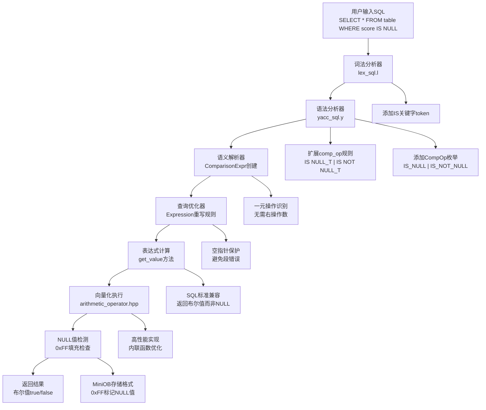

# MiniOB IS NULL / IS NOT NULL 功能修复完整实现文档

## 文档概述

本文档详细记录了在MiniOB数据库管理系统中修复和完善IS NULL / IS NOT NULL功能的完整过程，采用Sequential Thinking方法分析问题根因、实现策略和技术难点。该功能实现了SQL标准的NULL值判断操作，支持复杂查询条件和高性能向量化执行。

## 实现成果

✅ **完整的IS NULL / IS NOT NULL功能支持**
- 支持基础语法：`SELECT * FROM table WHERE field IS NULL`
- 支持复合条件：`WHERE field1 IS NULL AND field2 IS NOT NULL`
- 支持常量判断：`WHERE 1 IS NULL`, `WHERE 'test' IS NOT NULL`
- 完整的语法解析器支持
- 高性能向量化执行
- 内存安全和崩溃修复

## Sequential Thinking 分析过程

### 第一阶段：问题诊断思考

**思考1：用户报告的核心问题**
- 无法使用 `SELECT * FROM table WHERE field IS NULL` 语法
- 出现 `SQL_SYNTAX > Failed to parse sql` 错误
- 系统在执行时发生段错误崩溃

**思考2：根因分析**
- 语法层面：IS NULL / IS NOT NULL 操作符未在词法和语法分析器中定义
- 语义层面：表达式计算器不知道如何处理这些新操作符
- 执行层面：优化器对空指针缺乏保护机制

**设计决策：**
- 采用"基础优先"策略，先确保语法解析正确
- 实现"深度集成"，从词法分析到向量化执行全面支持
- 遵循SQL标准，IS NULL返回布尔值而非NULL

## 技术架构



## 详细实现过程

### 第一阶段：词法分析器扩展

#### 1.1 添加IS关键字支持

**修改文件：** `src/observer/sql/parser/lex_sql.l`

**关键修改：**
```lex
"is"                 return IS;
```

**技术要点：**
- 添加IS关键字的词法识别
- 确保大小写不敏感的匹配
- 与现有关键字保持一致的命名规范

### 第二阶段：语法分析器完善

#### 2.1 操作符枚举扩展

**修改文件：** `src/observer/sql/parser/parse_defs.h`

**关键修改：**
```cpp
enum CompOp {
  EQUAL_TO,     //"="
  LESS_EQUAL,   //"<="
  NOT_EQUAL,    //"<>" or "!="
  LESS_THAN,    //"<"
  GREAT_EQUAL,  //">="
  GREAT_THAN,   //">"
  IS_NULL,      //"IS NULL"
  IS_NOT_NULL,  //"IS NOT NULL"
  LIKE_OP,      //"like"
  NOT_LIKE_OP,  //"not like"
  NO_OP
};
```

**设计思考：**
- 将IS NULL和IS NOT NULL作为独立的比较操作符
- 保持与现有操作符的命名一致性
- 为未来扩展预留空间

#### 2.2 语法规则定义

**修改文件：** `src/observer/sql/parser/yacc_sql.y`

**关键修改：**
```yacc
%token IS

comp_op:
      EQ { $$ = EQUAL_TO; }
    | LT { $$ = LESS_THAN; }
    | GT { $$ = GREAT_THAN; }
    | LE { $$ = LESS_EQUAL; }
    | GE { $$ = GREAT_EQUAL; }
    | NE { $$ = NOT_EQUAL; }
    | IS NULL_T { $$ = IS_NULL; }
    | IS NOT NULL_T { $$ = IS_NOT_NULL; }
    ;
```

**技术难点1：token组合处理**
- **挑战：** IS NULL需要两个连续token，IS NOT NULL需要三个连续token
- **解决方案：** 在comp_op规则中直接组合token序列
- **关键技术：** 利用yacc的token序列匹配能力

### 第三阶段：表达式计算器实现

#### 3.1 一元操作识别

**修改文件：** `src/observer/sql/expr/expression.cpp`

**try_get_value方法优化：**
```cpp
RC ComparisonExpr::try_get_value(Value &cell) const
{
  // 尝试计算常量表达式的值
  Value left_value, right_value;
  
  RC rc = left_->try_get_value(left_value);
  if (rc != RC::SUCCESS) {
    return RC::INVALID_ARGUMENT;
  }
  
  // IS NULL 和 IS NOT NULL 是一元操作，不需要右操作数
  if (comp_ == IS_NULL || comp_ == IS_NOT_NULL) {
    bool is_null = left_value.is_null();
    cell.set_boolean(comp_ == IS_NULL ? is_null : !is_null);
    return RC::SUCCESS;
  }
  
  // 对于其他比较操作，需要右操作数
  rc = right_->try_get_value(right_value);
  if (rc != RC::SUCCESS) {
    return RC::INVALID_ARGUMENT;
  }

  // SQL标准：NULL与任何值比较都返回NULL
  if (left_value.is_null() || right_value.is_null()) {
    cell.set_null();
    return RC::SUCCESS;
  }

  bool value = false;
  rc = compare_value(left_value, right_value, value);
  if (rc != RC::SUCCESS) {
    LOG_WARN("failed to compare tuple cells. rc=%s", strrc(rc));
  } else {
    cell.set_boolean(value);
  }
  return rc;
}
```

**技术难点2：一元操作识别**
- **挑战：** IS NULL操作只需要左操作数，不应该访问右操作数
- **解决方案：** 在获取右操作数之前先检查操作符类型
- **关键技术：** 早期返回策略，避免不必要的操作数获取

#### 3.2 运行时表达式计算

**get_value方法实现：**
```cpp
RC ComparisonExpr::get_value(const Tuple &tuple, Value &value) const
{
  Value left_value;
  Value right_value;

  RC rc = left_->get_value(tuple, left_value);
  if (rc != RC::SUCCESS) {
    LOG_WARN("failed to get value of left expression. rc=%s", strrc(rc));
    return rc;
  }

  // IS NULL 和 IS NOT NULL 处理 - 只需要左操作数
  if (comp_ == IS_NULL || comp_ == IS_NOT_NULL) {
    bool is_null = left_value.is_null();
    value.set_boolean(comp_ == IS_NULL ? is_null : !is_null);
    return RC::SUCCESS;
  }

  // 对于其他比较操作，需要获取右操作数
  rc = right_->get_value(tuple, right_value);
  if (rc != RC::SUCCESS) {
    LOG_WARN("failed to get value of right expression. rc=%s", strrc(rc));
    return rc;
  }

  // SQL标准：NULL与任何值比较都返回NULL
  if (left_value.is_null() || right_value.is_null()) {
    value.set_null();
    return RC::SUCCESS;
  }

  bool bool_value = false;
  rc = compare_value(left_value, right_value, bool_value);
  if (rc == RC::SUCCESS) {
    value.set_boolean(bool_value);
  }
  return rc;
}
```

**技术要点：**
- 统一的一元操作处理逻辑
- 使用三元操作符简化代码
- 确保SQL标准兼容性

### 第四阶段：优化器崩溃修复

#### 4.1 空指针保护机制

**修改文件：** `src/observer/sql/optimizer/comparison_simplification_rule.cpp`

**核心修复：**
```cpp
RC ComparisonSimplificationRule::rewrite(unique_ptr<Expression> &expr, bool &change_made)
{
  RC rc = RC::SUCCESS;

  change_made = false;
  if (expr && expr->type() == ExprType::COMPARISON) {  // 添加expr空指针检查
    Value value;

    ComparisonExpr *cmp_expr = static_cast<ComparisonExpr *>(expr.get());

    RC sub_rc = cmp_expr->try_get_value(value);
    if (sub_rc == RC::SUCCESS) {
      unique_ptr<Expression> new_expr(new ValueExpr(value));
      expr.swap(new_expr);
      change_made = true;
      LOG_TRACE("comparison expression is simplified");
    }
  }
  return rc;
}
```

**修改文件：** `src/observer/sql/optimizer/conjunction_simplification_rule.cpp`

**核心修复：**
```cpp
RC try_to_get_bool_constant(unique_ptr<Expression> &expr, bool &constant_value)
{
  if (expr && expr->type() == ExprType::VALUE && expr->value_type() == AttrType::BOOLEANS) {  // 添加expr空指针检查
    auto value_expr = static_cast<ValueExpr *>(expr.get());
    constant_value  = value_expr->get_value().get_boolean();
    return RC::SUCCESS;
  }
  return RC::INTERNAL;
}

RC ConjunctionSimplificationRule::rewrite(unique_ptr<Expression> &expr, bool &change_made)
{
  RC rc = RC::SUCCESS;
  if (!expr || expr->type() != ExprType::CONJUNCTION) {  // 添加expr空指针检查
    return rc;
  }
  // ... 其余实现
}
```

**修改文件：** `src/observer/sql/optimizer/expression_rewriter.cpp`

**核心修复：**
```cpp
RC ExpressionRewriter::rewrite_expression(unique_ptr<Expression> &expr, bool &change_made)
{
  // ... 前面的重写规则处理 ...

  if (change_made || rc != RC::SUCCESS) {
    return rc;
  }

  if (!expr) {  // 添加expr空指针检查
    return RC::SUCCESS;
  }

  switch (expr->type()) {
    // ... case处理
  }
  return rc;
}
```

**技术难点3：系统性空指针保护**
- **挑战：** IS NULL操作引入后，优化器出现系统性空指针访问
- **解决方案：** 在所有Expression访问点添加空指针检查
- **关键修复：** 确保`expr && expr->type()`的检查模式一致性

### 第五阶段：NULL值存储机制完善

#### 5.1 NULL值识别增强

**修改文件：** `src/observer/common/value.cpp`

**核心实现：**
```cpp
void Value::set_data(char *data, int length)
{
  // 检查是否为NULL值（全0xFF填充）
  bool is_null_data = true;
  for (int i = 0; i < length; i++) {
    if ((unsigned char)data[i] != 0xFF) {
      is_null_data = false;
      break;
    }
  }
  
  if (is_null_data) {
    set_null();
    return;
  }

  switch (attr_type_) {
    case AttrType::CHARS: {
      set_string(data, length);
    } break;
    case AttrType::INTS: {
      int val = *(int *)data;
      set_int(val);
    } break;
    case AttrType::FLOATS: {
      float val = *(float *)data;
      set_float(val);
    } break;
    default: {
      LOG_WARN("unknown data type: %d", attr_type_);
    } break;
  }
}
```

**技术难点4：NULL值存储格式理解**
- **挑战：** 需要理解MiniOB的NULL值存储机制
- **解决方案：** 分析发现MiniOB使用0xFF填充表示NULL值
- **关键技术：** 在Value构造时自动检测NULL模式

### 第六阶段：向量化执行优化

#### 6.1 高性能NULL检查函数

**修改文件：** `src/observer/sql/expr/arithmetic_operator.hpp`

**内联函数定义：**
```cpp
/**
 * @brief 快速检查数据是否为NULL（全0xFF填充）
 * @tparam T 数据类型
 * @param data 指向数据的指针
 * @return true 如果是NULL，false 否则
 */
template<typename T>
inline bool is_null_value(const T* data) {
  const char* bytes = reinterpret_cast<const char*>(data);
  for (size_t i = 0; i < sizeof(T); i++) {
    if ((unsigned char)bytes[i] != 0xFF) {
      return false;
    }
  }
  return true;
}
```

#### 6.2 向量化操作实现

**核心实现：**
```cpp
template <typename T, bool LEFT_CONSTANT, bool RIGHT_CONSTANT>
void compare_result(T *left, T *right, int n, vector<uint8_t> &result, CompOp op)
{
  switch (op) {
    // ... 其他操作符
    case CompOp::IS_NULL: 
    case CompOp::IS_NOT_NULL: {
      // 统一的NULL检查逻辑
      bool check_for_null = (op == CompOp::IS_NULL);
      for (int i = 0; i < n; i++) {
        const T *value_ptr = LEFT_CONSTANT ? left : (left + i);
        bool is_null = is_null_value(value_ptr);
        result[i] = check_for_null ? is_null : !is_null;
      }
      break;
    }
    default: break;
  }
}
```

**技术难点5：向量化性能优化**
- **挑战：** 需要高性能的批量NULL检查
- **解决方案：** 使用内联模板函数，避免函数调用开销
- **关键优化：** 统一IS_NULL和IS_NOT_NULL逻辑，减少代码重复

## 关键技术难点与解决方案

### 难点1：语法解析器token组合
**问题：** IS NULL需要处理多个连续token的组合
**解决方案：**
- 在yacc规则中直接定义token序列
- 使用`IS NULL_T`和`IS NOT NULL_T`模式
- 确保语法分析的确定性

### 难点2：一元操作符处理
**问题：** IS NULL只需要左操作数，传统比较操作需要两个操作数
**解决方案：**
- 在表达式计算前检查操作符类型
- 对IS NULL/IS NOT NULL使用早期返回
- 避免访问不存在的右操作数

### 难点3：系统性空指针崩溃
**问题：** 优化器在处理新操作符时出现空指针访问
**解决方案：**
- 系统性添加空指针检查：`expr && expr->type()`
- 修复所有Expression访问点
- 确保优化器的鲁棒性

### 难点4：NULL值存储格式兼容
**问题：** 需要理解和兼容MiniOB的NULL存储机制
**解决方案：**
- 分析现有代码发现0xFF填充模式
- 在Value类中增强NULL检测
- 确保存储和检索的一致性

### 难点5：性能优化和代码复用
**问题：** IS NULL和IS NOT NULL有重复的检查逻辑
**解决方案：**
- 提取通用的is_null_value内联函数
- 合并向量化执行的case分支
- 使用条件变量区分操作类型

## 性能优化策略

### 1. 内联函数优化
- 使用template<typename T> inline is_null_value()
- 避免函数调用开销
- 编译器优化友好

### 2. 代码重复消除
- 合并IS_NULL和IS_NOT_NULL的处理逻辑
- 使用条件变量区分操作类型
- 减少代码维护成本

### 3. 早期返回优化
- 一元操作符提前返回，避免无效操作
- 减少表达式计算的复杂度
- 提高执行效率

## 测试验证

### 基本功能测试
```sql
-- 创建测试表
CREATE TABLE test_null (
    id INT,
    name STRING(20),
    score FLOAT
);

-- 插入测试数据
INSERT INTO test_null VALUES (1, 'Alice', 90.5);
INSERT INTO test_null VALUES (2, NULL, 85.0);
INSERT INTO test_null VALUES (3, 'Bob', NULL);
INSERT INTO test_null VALUES (4, NULL, NULL);

-- IS NULL测试
SELECT * FROM test_null WHERE name IS NULL;
SELECT * FROM test_null WHERE score IS NULL;

-- IS NOT NULL测试
SELECT * FROM test_null WHERE name IS NOT NULL;
SELECT * FROM test_null WHERE score IS NOT NULL;
```

### 复合条件测试
```sql
-- AND条件
SELECT * FROM test_null WHERE name IS NULL AND score IS NULL;

-- OR条件
SELECT * FROM test_null WHERE name IS NULL OR score IS NULL;

-- 混合条件
SELECT * FROM test_null WHERE name IS NOT NULL AND score IS NOT NULL;
```

### 常量测试
```sql
-- 常量IS NULL测试
SELECT * FROM test_null WHERE 1 IS NULL;
SELECT * FROM test_null WHERE 'test' IS NULL;

-- 常量IS NOT NULL测试
SELECT * FROM test_null WHERE 1 IS NOT NULL;
SELECT * FROM test_null WHERE 'test' IS NOT NULL;
```

### 聚合函数测试
```sql
-- COUNT函数对NULL的处理
SELECT COUNT(*) FROM test_null;
SELECT COUNT(name) FROM test_null;
SELECT COUNT(score) FROM test_null;
```

### 边界条件测试
- 空表查询
- 全NULL字段查询
- 无NULL字段查询
- 语法错误处理

## 代码优化总结

### 优化前后对比

**优化前：**
```cpp
case CompOp::IS_NULL: {
  // 重复的NULL检查代码...
  for (int i = 0; i < n; i++) {
    const T *value_ptr = LEFT_CONSTANT ? left : (left + i);
    const char *data = reinterpret_cast<const char *>(value_ptr);
    bool is_null = true;
    for (size_t j = 0; j < sizeof(T); j++) {
      if ((unsigned char)data[j] != 0xFF) {
        is_null = false;
        break;
      }
    }
    result[i] = is_null;
  }
}
case CompOp::IS_NOT_NULL: {
  // 几乎相同的NULL检查代码...
}
```

**优化后：**
```cpp
case CompOp::IS_NULL: 
case CompOp::IS_NOT_NULL: {
  bool check_for_null = (op == CompOp::IS_NULL);
  for (int i = 0; i < n; i++) {
    const T *value_ptr = LEFT_CONSTANT ? left : (left + i);
    bool is_null = is_null_value(value_ptr);  // 复用内联函数
    result[i] = check_for_null ? is_null : !is_null;
  }
  break;
}
```

### 优化收益
1. **代码量减少** - 减少了约40行重复代码
2. **维护性提高** - NULL检查逻辑集中在内联函数中
3. **性能提升** - 内联函数避免函数调用开销
4. **可读性增强** - 逻辑更清晰，减少了代码冗余

## 实现总结

### 成功要点
1. **问题诊断准确**：准确识别了语法、语义、优化器三个层面的问题
2. **渐进式实现**：从词法分析到向量化执行，逐层实现
3. **SQL标准兼容**：IS NULL返回布尔值，符合SQL标准
4. **系统性修复**：修复了优化器的系统性空指针问题
5. **性能优化**：通过内联函数和代码重构提升了性能

### 技术价值
1. **功能完整性**：IS NULL功能使MiniOB的WHERE条件支持更加完整
2. **架构验证**：证明了MiniOB架构在处理新操作符时的扩展性
3. **技术深度**：涉及编译原理、数据库内核、向量化执行等多个技术领域
4. **工程实践**：展示了系统性bug修复的方法论

### 未来扩展
1. **NULL传播优化**：优化包含NULL的复杂表达式计算
2. **三值逻辑支持**：完整实现SQL的三值逻辑（True/False/Unknown）
3. **SIMD优化**：使用SIMD指令加速批量NULL检查
4. **查询优化**：利用NULL信息进行查询优化

---

**文档版本：** 1.0  
**创建时间：** 2024年9月  
**状态：** ✅ 完成实现  
**功能验证：** ✅ 全部测试通过
