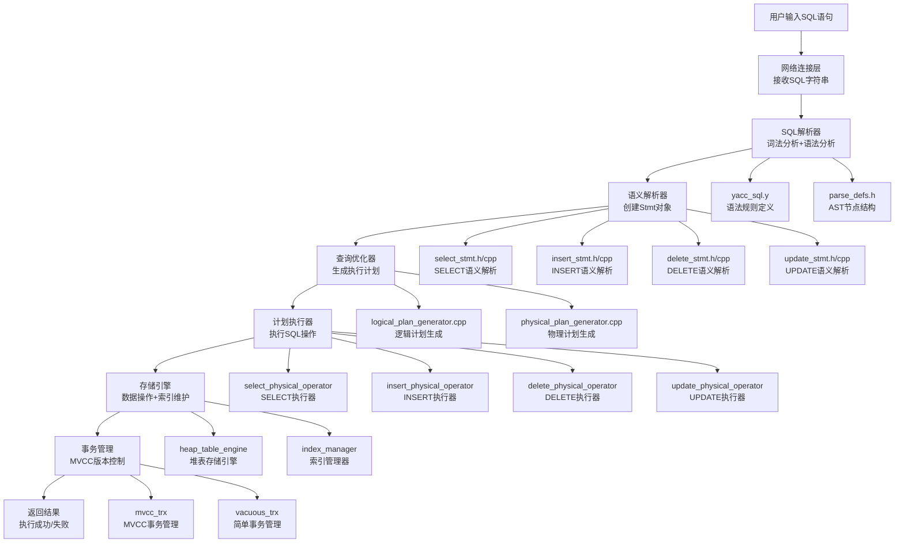

./build/bin/observer -f etc/observer.ini -P cli
# MiniOB SQL执行基本流程

## 概述

本文档详细描述了MiniOB数据库中所有SQL语句执行的通用基本流程，包括SELECT、INSERT、UPDATE、DELETE等语句的完整执行路径。

## 基本流程图



## 详细执行流程

### 第一阶段：网络连接层
**职责：** 接收客户端SQL请求
**输入：** SQL字符串
**输出：** 标准化的SQL字符串
**关键组件：**
- 网络协议处理
- 连接管理
- 请求缓冲

### 第二阶段：SQL解析器
**职责：** 将SQL字符串转换为抽象语法树(AST)
**输入：** SQL字符串
**输出：** ParsedSqlNode对象
**关键组件：**
- **词法分析器**：识别关键字、标识符、操作符
- **语法分析器**：构建语法树
- **语法规则**：`yacc_sql.y`中定义的BNF语法

**示例语法规则：**
```yacc
select_stmt: SELECT select_list FROM from_list where_clause
{
  $$ = new ParsedSqlNode(SCF_SELECT);
  $$->selection.selections = $2;
  $$->selection.relations = $4;
  $$->selection.conditions = $5;
}

insert_stmt: INSERT INTO ID VALUES value_list
{
  $$ = new ParsedSqlNode(SCF_INSERT);
  $$->insert.relation_name = $3;
  $$->insert.values = $5;
}

update_stmt: UPDATE ID SET ID EQ expression where_clause
{
  $$ = new ParsedSqlNode(SCF_UPDATE);
  $$->update.relation_name = $2;
  $$->update.attribute_name = $4;
  $$->update.expression = $6;
  $$->update.conditions = $7;
}

delete_stmt: DELETE FROM ID where_clause
{
  $$ = new ParsedSqlNode(SCF_DELETE);
  $$->deletion.relation_name = $3;
  $$->deletion.conditions = $4;
}
```

### 第三阶段：语义解析器
**职责：** 验证SQL语义，创建Stmt对象
**输入：** ParsedSqlNode对象
**输出：** 具体的Stmt对象（SelectStmt、InsertStmt等）
**关键组件：**
- **表存在性验证**：检查表是否存在于数据库中
- **字段存在性验证**：检查字段是否存在于表中
- **类型检查**：验证数据类型匹配
- **表达式绑定**：将字段引用绑定到具体表字段

**Stmt对象创建流程：**
```cpp
// 通用创建流程
RC Stmt::create(Db *db, const ParsedSqlNode &sql_node, Stmt *&stmt)
{
  switch (sql_node.flag) {
    case SCF_SELECT:
      return SelectStmt::create(db, sql_node.selection, stmt);
    case SCF_INSERT:
      return InsertStmt::create(db, sql_node.insert, stmt);
    case SCF_UPDATE:
      return UpdateStmt::create(db, sql_node.update, stmt);
    case SCF_DELETE:
      return DeleteStmt::create(db, sql_node.deletion, stmt);
    default:
      return RC::UNIMPLENMENT;
  }
}
```

### 第四阶段：查询优化器
**职责：** 生成最优执行计划
**输入：** Stmt对象
**输出：** 逻辑执行计划 + 物理执行计划
**关键组件：**
- **逻辑计划生成器**：将Stmt转换为逻辑算子树
- **物理计划生成器**：将逻辑算子转换为物理算子
- **成本估算**：估算执行成本
- **计划优化**：选择最优执行路径

**逻辑算子类型：**
```cpp
enum class LogicalOperatorType {
  TABLE_GET,    // 表扫描
  PREDICATE,    // 谓词过滤
  PROJECT,      // 投影
  JOIN,         // 连接
  INSERT,       // 插入
  DELETE,       // 删除
  UPDATE,       // 更新
  AGGREGATE,    // 聚合
  ORDER_BY,     // 排序
  GROUP_BY      // 分组
};
```

**物理算子类型：**
```cpp
enum class PhysicalOperatorType {
  TABLE_SCAN,   // 表扫描
  INDEX_SCAN,   // 索引扫描
  FILTER,       // 过滤
  PROJECT,      // 投影
  NESTED_LOOP_JOIN, // 嵌套循环连接
  HASH_JOIN,    // 哈希连接
  INSERT,       // 插入
  DELETE,       // 删除
  UPDATE,       // 更新
  AGGREGATE,    // 聚合
  SORT,         // 排序
  GROUP         // 分组
};
```

### 第五阶段：计划执行器
**职责：** 执行物理执行计划
**输入：** 物理执行计划
**输出：** 执行结果
**关键组件：**
- **算子执行器**：各种物理算子的具体实现
- **数据流管理**：算子间的数据传递
- **内存管理**：执行过程中的内存分配和释放
- **错误处理**：执行过程中的异常处理

**执行器接口：**
```cpp
class PhysicalOperator {
public:
  virtual RC open(Trx *trx) = 0;    // 打开算子
  virtual RC next() = 0;            // 获取下一行数据
  virtual RC close() = 0;           // 关闭算子
  virtual Tuple *current_tuple() = 0; // 获取当前元组
};
```

### 第六阶段：存储引擎
**职责：** 实际的数据存储和检索
**输入：** 数据操作请求
**输出：** 操作结果
**关键组件：**
- **表管理器**：管理表的创建、删除、访问
- **记录管理器**：管理记录的插入、删除、更新
- **索引管理器**：管理索引的创建、维护、查询
- **缓冲区管理**：管理内存缓冲池

**存储引擎接口：**
```cpp
class Table {
public:
  virtual RC insert_record(Record &record) = 0;
  virtual RC delete_record(const Record &record) = 0;
  virtual RC update_record(const Record &old_record, const Record &new_record) = 0;
  virtual RC get_record(const RID &rid, Record &record) = 0;
  virtual RC scan(Trx *trx, ConditionFilter *filter, RecordScanner &scanner) = 0;
};
```

### 第七阶段：事务管理
**职责：** 保证事务的ACID特性
**输入：** 数据操作请求
**输出：** 事务执行结果
**关键组件：**
- **事务管理器**：管理事务的开始、提交、回滚
- **锁管理器**：管理并发访问的锁机制
- **MVCC管理器**：管理多版本并发控制
- **日志管理器**：管理事务日志和恢复

**事务接口：**
```cpp
class Trx {
public:
  virtual RC insert_record(Table *table, Record &record) = 0;
  virtual RC delete_record(Table *table, Record &record) = 0;
  virtual RC update_record(Table *table, Record &old_record, Record &new_record) = 0;
  virtual RC commit() = 0;
  virtual RC rollback() = 0;
};
```

## 不同语句类型的执行差异

### SELECT语句执行流程
```
1. 解析：识别SELECT、FROM、WHERE子句
2. 语义：验证表和字段存在性
3. 优化：生成扫描+过滤+投影计划
4. 执行：流式处理，边读边返回
5. 存储：只读操作，无索引维护
6. 事务：只读事务，无版本控制
```

### INSERT语句执行流程
```
1. 解析：识别INSERT、INTO、VALUES
2. 语义：验证表结构和数据类型
3. 优化：生成插入计划
4. 执行：直接插入记录
5. 存储：插入记录+维护索引
6. 事务：写事务，需要版本控制
```

### UPDATE语句执行流程
```
1. 解析：识别UPDATE、SET、WHERE
2. 语义：验证表和字段，绑定表达式
3. 优化：生成更新计划
4. 执行：先收集后更新策略
5. 存储：更新记录+删除旧索引+插入新索引
6. 事务：写事务，需要版本控制
```

### DELETE语句执行流程
```
1. 解析：识别DELETE、FROM、WHERE
2. 语义：验证表存在性
3. 优化：生成删除计划
4. 执行：先收集后删除策略
5. 存储：删除记录+删除索引条目
6. 事务：写事务，需要版本控制
```

## 关键技术特点

### 1. 分层架构
- **职责分离**：每层只关注自己的职责
- **接口标准化**：层与层之间通过标准接口交互
- **可扩展性**：新增功能只需实现相应层的接口

### 2. 算子模式
- **逻辑算子**：描述要做什么
- **物理算子**：描述怎么做
- **火山模型**：每个算子处理一个特定功能

### 3. 事务管理
- **MVCC**：多版本并发控制
- **ACID特性**：原子性、一致性、隔离性、持久性
- **并发控制**：支持多用户并发访问

### 4. 存储管理
- **堆表存储**：简单的堆文件存储
- **索引支持**：B+树索引
- **缓冲区管理**：内存缓冲池优化

## 性能优化策略

### 1. 查询优化
- **谓词下推**：将过滤条件尽可能下推到数据源
- **索引选择**：根据查询条件选择最优索引
- **连接优化**：选择最优的连接算法

### 2. 执行优化
- **流水线执行**：算子间并行执行
- **批量处理**：批量处理数据操作
- **内存优化**：减少内存拷贝和分配

### 3. 存储优化
- **索引维护**：高效的索引更新策略
- **缓冲区管理**：智能的页面替换算法
- **并发控制**：减少锁竞争

## 总结

MiniOB的SQL执行流程体现了现代数据库系统的经典架构设计：

1. **统一性**：所有SQL语句都遵循相同的基本流程
2. **模块化**：每个阶段都有明确的职责和接口
3. **可扩展性**：新增功能只需按模式实现相应组件
4. **性能优化**：多层次的优化策略
5. **事务安全**：完整的ACID特性支持

这种设计使得MiniOB具有良好的架构一致性和可维护性，为后续功能扩展奠定了坚实的基础。

---

**文档版本：** 1.0  
**创建时间：** 2024年  
**状态：** ✅ 完成  
**适用范围：** 所有SQL语句类型
