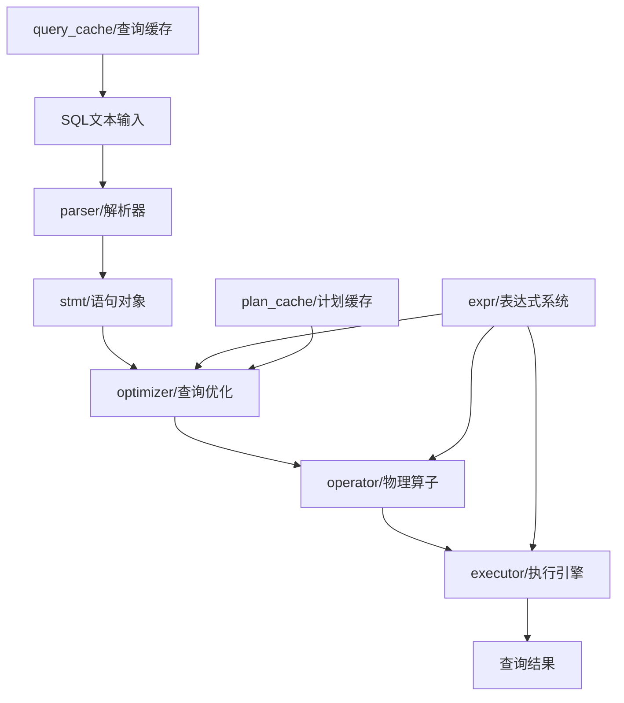

# SQL模块功能结构分析 - 对齐文档

## 项目上下文分析

### 技术架构
- **项目**: OBZen-zhanghao-2024 (基于MiniOB的数据库系统)
- **技术栈**: C++数据库内核实现
- **架构模式**: 分层架构 + 管道处理模式
- **核心目录**: `/src/observer/sql/` - SQL处理引擎核心模块

### 现有项目特性
- 基于经典数据库系统架构设计
- 采用多阶段处理管道 (Parse → Resolve → Optimize → Execute)
- 支持向量化执行引擎 (Vec Physical Operators)
- 完整的SQL语句类型支持 (DDL/DML/TCL)
- 基于算子的查询执行模型

## 原始需求理解

### 用户查询
用户希望了解`@sql/`目录下各个子目录的功能职责划分，以便理解整个SQL处理引擎的架构设计。

### 分析范围
- **目标目录**: `/src/observer/sql/`
- **包含模块**: 8个核心子模块
  - parser/ - SQL解析器
  - stmt/ - 语句抽象层
  - optimizer/ - 查询优化器
  - operator/ - 算子实现
  - executor/ - 执行引擎
  - expr/ - 表达式系统
  - plan_cache/ - 计划缓存
  - query_cache/ - 查询缓存

## SQL处理管道架构分析

### 整体处理流程
```
SQL文本 → Parser → Stmt → Optimizer → Physical Plan → Executor → Result
```

### 数据流转关系


## 需求边界确认

### 明确范围
✅ **包含内容**:
- 8个核心子模块的功能职责
- 模块间的协作关系
- 关键类和接口说明
- 处理流程说明

❌ **不包含内容**:
- 具体代码实现细节
- 性能调优建议
- 新功能开发指导

### 分析深度
- **概念层面**: 各模块的核心职责和设计理念
- **架构层面**: 模块间的依赖关系和数据流
- **接口层面**: 关键类和主要方法签名

## 疑问澄清

### 已解决问题
1. ✅ SQL处理的整体架构模式已明确
2. ✅ 各子模块的文件结构已获取
3. ✅ 关键接口和类定义已分析
4. ✅ 向量化执行的支持情况已确认

### 待确认问题
暂无需要用户确认的技术问题，基于现有代码分析已足够完整。

## 分析方法

### 技术手段
1. **静态代码分析**: 通过头文件分析类定义和接口
2. **目录结构分析**: 理解模块组织方式
3. **命名约定分析**: 从类名和文件名推断功能职责
4. **依赖关系分析**: 通过include关系理解模块协作

### 文档输出
将生成详细的模块功能分析文档，包含：
- 各模块功能详述
- 关键类和接口说明
- 模块协作关系图
- 处理流程说明

## 技术约束

### 现有架构约束
- 必须遵循现有的分层架构设计
- 保持与现有接口的兼容性
- 符合C++编码规范

### 分析约束
- 基于现有代码进行分析，不进行代码修改
- 重点关注架构层面的功能划分
- 避免过度深入实现细节
