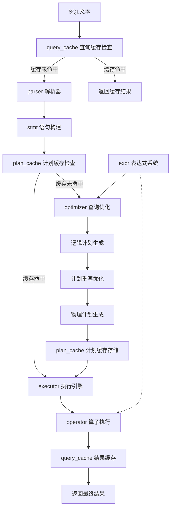

# SQL模块功能结构分析 - 共识文档

## 执行共识

### 分析目标
对 `/src/observer/sql/` 目录下的8个核心子模块进行功能职责分析，输出清晰的架构说明文档。

### 技术方案
采用静态代码分析方法，基于现有代码结构和接口定义，分析各模块的功能职责和协作关系。

### 任务边界
**包含范围**:
- 8个子模块的功能职责详述
- 模块间协作关系说明
- SQL处理流程分析
- 关键类和接口概述

**排除范围**:
- 具体代码实现细节
- 性能优化建议
- 开发指导内容

### 验收标准
1. 每个模块功能描述清晰准确
2. 模块间关系图直观易懂  
3. 处理流程说明完整
4. 关键接口信息准确

### 技术约束
- 基于现有代码分析，不进行修改
- 遵循项目现有架构设计
- 输出格式化的Markdown文档

## 模块功能详细分析

### 1. parser/ - SQL解析器模块

**核心职责**: 将SQL文本转换为抽象语法树(AST)

**主要组件**:
- `lex_sql.l` - 词法分析器 (Flex)
- `yacc_sql.y` - 语法分析器 (Bison)  
- `parse_stage.cpp/h` - 解析阶段处理器
- `resolve_stage.cpp/h` - 语义解析器
- `expression_binder.cpp/h` - 表达式绑定器

**关键功能**:
- 词法分析: 将SQL文本分解为Token
- 语法分析: 构建语法树结构
- 语义分析: 解析表名、字段名等语义信息
- 表达式绑定: 将未绑定表达式转换为具体字段引用

**输入**: SQL文本字符串
**输出**: `ParsedSqlNode` 解析结果

### 2. stmt/ - 语句抽象层模块

**核心职责**: 将解析结果转换为结构化的Statement对象

**主要组件**:
- `stmt.h` - Statement基类定义
- `select_stmt.cpp/h` - SELECT语句处理
- `insert_stmt.cpp/h` - INSERT语句处理  
- `update_stmt.cpp/h` - UPDATE语句处理
- `delete_stmt.cpp/h` - DELETE语句处理
- `create_table_stmt.cpp/h` - CREATE TABLE语句处理
- 其他DDL/TCL语句处理类

**支持的语句类型**:
```cpp
enum class StmtType {
  CALC, SELECT, INSERT, UPDATE, DELETE,
  CREATE_TABLE, DROP_TABLE, ANALYZE_TABLE,
  CREATE_INDEX, DROP_INDEX, SYNC,
  SHOW_TABLES, DESC_TABLE,
  BEGIN, COMMIT, ROLLBACK,
  LOAD_DATA, HELP, EXIT, EXPLAIN,
  PREDICATE, SET_VARIABLE
};
```

**关键功能**:
- 语句类型识别和分发
- 将解析树转换为强类型Statement对象
- 表名和字段名解析为实际的数据库对象引用
- 条件表达式的构建和验证

**输入**: `ParsedSqlNode`解析树
**输出**: 具体的Statement子类对象

### 3. optimizer/ - 查询优化器模块

**核心职责**: 生成并优化查询执行计划

**主要组件**:
- `optimize_stage.cpp/h` - 优化阶段主控制器
- `logical_plan_generator.cpp/h` - 逻辑计划生成器
- `physical_plan_generator.cpp/h` - 物理计划生成器
- `rewriter.cpp/h` - 逻辑计划重写器
- `expression_rewriter.cpp/h` - 表达式重写器
- `predicate_pushdown_rewriter.cpp/h` - 谓词下推重写器
- `cascade/` - Cascade优化框架
- `statistics/` - 统计信息模块

**优化流程**:
```
Statement → Logical Plan → Rewrite → Optimize → Physical Plan
```

**关键功能**:
- **逻辑计划生成**: 将Statement转换为逻辑算子树
- **规则重写**: 应用各种重写规则优化逻辑计划
  - 谓词下推 (Predicate Pushdown)
  - 比较简化 (Comparison Simplification) 
  - 联结简化 (Conjunction Simplification)
  - 谓词转联结 (Predicate to Join)
- **代价优化**: 基于统计信息的代价模型优化
- **物理计划生成**: 选择具体的物理算子实现

**输入**: Statement对象
**输出**: `PhysicalOperator`物理执行计划

### 4. operator/ - 算子实现模块

**核心职责**: 实现查询执行的各种算子

**算子分类**:

**逻辑算子** (Logical Operators):
- `table_get_logical_operator` - 表访问
- `predicate_logical_operator` - 条件过滤
- `project_logical_operator` - 投影
- `join_logical_operator` - 联结
- `group_by_logical_operator` - 分组
- `insert/update/delete_logical_operator` - DML操作

**物理算子** (Physical Operators):
- **扫描算子**:
  - `table_scan_physical_operator` - 全表扫描
  - `table_scan_vec_physical_operator` - 向量化全表扫描
  - `index_scan_physical_operator` - 索引扫描
- **联结算子**:
  - `nested_loop_join_physical_operator` - 嵌套循环联结
  - `hash_join_physical_operator` - 哈希联结
- **聚合算子**:
  - `scalar_group_by_physical_operator` - 标量分组聚合
  - `hash_group_by_physical_operator` - 哈希分组聚合
  - `group_by_vec_physical_operator` - 向量化分组聚合
- **其他算子**:
  - `predicate_physical_operator` - 条件过滤
  - `project_physical_operator` - 投影
  - `insert/update/delete_physical_operator` - DML执行

**执行模型**:
```cpp
class PhysicalOperator {
public:
  virtual RC open(Trx *trx) = 0;      // 初始化
  virtual RC next() = 0;              // 获取下一行
  virtual RC next(Chunk &chunk) = 0;  // 向量化获取
  virtual RC close() = 0;             // 清理资源
  virtual Tuple *current_tuple() = 0; // 当前行数据
};
```

### 5. executor/ - 执行引擎模块

**核心职责**: 协调和执行物理算子，处理DDL命令

**主要组件**:
- `execute_stage.cpp/h` - 执行阶段主控制器
- `command_executor.cpp/h` - DDL命令执行器
- `sql_result.cpp/h` - 查询结果封装
- 各种DDL执行器:
  - `create_table_executor` - 建表执行器
  - `create_index_executor` - 建索引执行器
  - `drop_table_executor` - 删表执行器
  - `load_data_executor` - 数据加载执行器

**执行策略**:
- **DML语句**: 通过物理算子树执行
- **DDL语句**: 通过命令执行器直接执行
- **TCL语句**: 通过事务管理器执行

**关键功能**:
- 物理算子树的初始化和执行
- DDL命令的解析和执行
- 查询结果的组装和返回
- 事务管理集成

### 6. expr/ - 表达式系统模块

**核心职责**: 实现各种表达式计算和数据结构

**主要组件**:
- `expression.h` - 表达式抽象基类
- `tuple.h` - 行数据抽象
- `tuple_cell.cpp/h` - 单元格数据
- `aggregator.cpp/h` - 聚合计算器
- `aggregate_hash_table.cpp/h` - 聚合哈希表
- `composite_tuple.cpp/h` - 复合行数据

**表达式类型**:
```cpp
enum class ExprType {
  STAR,           // SELECT *
  FIELD,          // 字段引用
  VALUE,          // 常量值
  CAST,           // 类型转换
  COMPARISON,     // 比较运算
  CONJUNCTION,    // 逻辑运算 (AND/OR)
  ARITHMETIC,     // 算术运算
  AGGREGATION     // 聚合函数
};
```

**关键功能**:
- **表达式计算**: 基于Tuple计算表达式值
- **类型转换**: 自动类型转换和强制转换
- **比较运算**: 支持各种比较操作符
- **聚合计算**: COUNT/SUM/AVG/MAX/MIN等聚合函数
- **向量化计算**: 支持批量计算优化

### 7. plan_cache/ - 计划缓存模块  

**核心职责**: 缓存查询执行计划，避免重复优化

**主要组件**:
- `plan_cache_stage.cpp/h` - 计划缓存阶段处理器

**关键功能**:
- 执行计划的缓存和检索
- 计划有效性验证
- 缓存淘汰策略
- 参数化查询支持

### 8. query_cache/ - 查询缓存模块

**核心职责**: 缓存查询结果，提升重复查询性能

**主要组件**:
- `query_cache_stage.cpp/h` - 查询缓存阶段处理器

**关键功能**:
- 查询结果的缓存和检索
- 缓存失效策略
- 内存管理
- 命中率统计

## 模块协作关系

### 处理流程图


### 依赖关系
- **parser** → **stmt**: 解析结果转换为语句对象
- **stmt** → **optimizer**: 语句对象生成执行计划  
- **optimizer** → **operator**: 生成物理算子树
- **operator** → **executor**: 算子由执行引擎调度
- **expr**: 被optimizer、operator、executor共同使用
- **plan_cache**: 与optimizer协作缓存执行计划
- **query_cache**: 与整个处理流程协作缓存结果

## 设计特点分析

### 1. 分层架构
采用经典的数据库分层架构，职责分离清晰，便于维护和扩展。

### 2. 管道处理
SQL处理采用多阶段管道模式，每个阶段负责特定的转换任务。

### 3. 向量化执行
支持向量化执行引擎，提升OLAP查询性能。

### 4. 缓存机制  
实现了计划缓存和查询缓存，优化重复查询性能。

### 5. 扩展性设计
模块化设计便于添加新的算子、优化规则和表达式类型。

## 总结

该SQL模块采用现代数据库系统的经典架构设计，具有以下优势：

✅ **架构清晰**: 8个模块职责分工明确
✅ **扩展性强**: 支持新算子和优化规则的添加  
✅ **性能优化**: 向量化执行和多级缓存机制
✅ **标准兼容**: 支持标准SQL语法和语义
✅ **代码质量**: 良好的抽象设计和接口定义

该架构为数据库查询处理提供了完整的解决方案，支持从SQL解析到结果返回的全流程处理。
