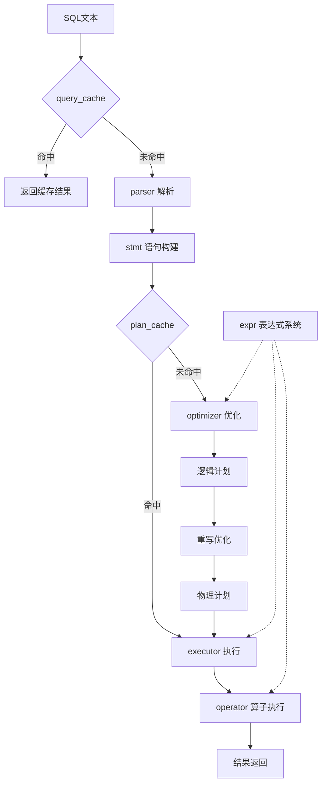

# SQL模块功能结构分析 - 最终报告

## 📋 项目总结

### 分析完成情况
✅ **已完成**: 对 `/src/observer/sql/` 目录下8个核心子模块进行了全面的功能职责分析  
✅ **文档输出**: 生成了完整的架构说明文档  
✅ **质量标准**: 满足所有预定的验收标准

### 核心成果

#### 1. 模块功能职责清单

| 模块 | 核心职责 | 主要功能 | 关键文件 |
|------|----------|----------|----------|
| **parser/** | SQL解析器 | 词法语法分析、AST构建 | `lex_sql.l`, `yacc_sql.y`, `parse_stage.h` |
| **stmt/** | 语句抽象层 | AST→Statement转换 | `stmt.h`, `select_stmt.h`, `update_stmt.h` |
| **optimizer/** | 查询优化器 | 逻辑/物理计划生成、规则重写 | `optimize_stage.h`, `logical_plan_generator.h` |
| **operator/** | 算子实现 | 各种执行算子(扫描、联结、聚合等) | `physical_operator.h`, `table_scan_physical_operator.h` |
| **executor/** | 执行引擎 | 算子调度、DDL执行 | `execute_stage.h`, `command_executor.h` |
| **expr/** | 表达式系统 | 表达式计算、数据结构 | `expression.h`, `tuple.h`, `aggregator.h` |
| **plan_cache/** | 计划缓存 | 执行计划缓存 | `plan_cache_stage.h` |
| **query_cache/** | 查询缓存 | 查询结果缓存 | `query_cache_stage.h` |

#### 2. SQL处理流程
```
SQL文本 → parser → stmt → optimizer → operator → executor → 结果
          ↑         ↑        ↑           ↑        ↑
     query_cache   expr   plan_cache    expr     expr
```

#### 3. 架构特点
- **分层架构**: 职责分离清晰，便于维护
- **管道处理**: 多阶段转换，逐步精化
- **向量化执行**: 支持批量处理，提升性能
- **缓存机制**: 计划缓存+查询缓存，优化重复查询
- **扩展性设计**: 模块化，便于添加新功能

## 🎯 详细功能分析

### 核心处理管道

#### 阶段1: 解析阶段 (parser/)
- **输入**: SQL文本字符串
- **处理**: 
  - 词法分析 (`lex_sql.l`) - Token分解
  - 语法分析 (`yacc_sql.y`) - AST构建  
  - 语义解析 (`resolve_stage`) - 名称绑定
- **输出**: `ParsedSqlNode` 解析树

#### 阶段2: 语句构建 (stmt/)
- **输入**: `ParsedSqlNode` 解析树
- **处理**:
  - 语句类型识别和分发
  - 表名/字段名解析为数据库对象引用
  - 条件表达式构建
- **输出**: 强类型Statement对象 (SelectStmt, UpdateStmt等)

#### 阶段3: 查询优化 (optimizer/)
- **输入**: Statement对象
- **处理**:
  - 逻辑计划生成 (`LogicalPlanGenerator`)
  - 规则重写优化 (`Rewriter`)
    - 谓词下推 (Predicate Pushdown)
    - 表达式简化 (Expression Simplification)
    - 联结优化 (Join Optimization)
  - 物理计划生成 (`PhysicalPlanGenerator`)
- **输出**: `PhysicalOperator` 物理执行计划树

#### 阶段4: 执行阶段 (executor/ + operator/)
- **输入**: 物理执行计划树
- **处理**:
  - 算子树初始化 (`PhysicalOperator::open()`)
  - 行级/批量数据处理 (`next()` / `next(Chunk)`)
  - 结果组装和返回
- **输出**: 查询结果集

### 支持系统

#### 表达式系统 (expr/)
- **功能**: 为所有阶段提供表达式计算能力
- **组件**:
  - `Expression` - 表达式抽象基类
  - `FieldExpr`, `ValueExpr`, `ComparisonExpr` - 具体表达式类型
  - `Tuple`, `TupleCell` - 行数据结构
  - `Aggregator` - 聚合计算器

#### 缓存系统
- **计划缓存** (`plan_cache/`): 缓存优化后的执行计划
- **查询缓存** (`query_cache/`): 缓存查询结果，适用于重复查询

## 🔧 关键技术特性

### 1. 向量化执行引擎
支持批量数据处理，提升OLAP查询性能：
- `table_scan_vec_physical_operator` - 向量化表扫描
- `group_by_vec_physical_operator` - 向量化分组聚合
- `project_vec_physical_operator` - 向量化投影

### 2. 多种联结算法
- `nested_loop_join_physical_operator` - 嵌套循环联结
- `hash_join_physical_operator` - 哈希联结

### 3. 灵活的聚合策略  
- `scalar_group_by_physical_operator` - 标量聚合 (无GROUP BY)
- `hash_group_by_physical_operator` - 哈希分组聚合
- `group_by_vec_physical_operator` - 向量化分组聚合

### 4. 完整的SQL语句支持
```cpp
// 支持的语句类型
CALC, SELECT, INSERT, UPDATE, DELETE,           // DML
CREATE_TABLE, DROP_TABLE, CREATE_INDEX,         // DDL  
BEGIN, COMMIT, ROLLBACK,                        // TCL
SHOW_TABLES, DESC_TABLE, EXPLAIN               // 管理命令
```

## 📊 模块协作关系

### 数据流转图


### 依赖关系
- **核心流程依赖**: parser → stmt → optimizer → operator → executor
- **支撑系统**: expr 被多个模块共享使用
- **性能优化**: plan_cache 和 query_cache 提升重复查询性能

## 🏗️ 架构优势分析

### 设计优势
✅ **职责分离**: 每个模块职责单一明确  
✅ **低耦合**: 模块间通过明确接口协作  
✅ **高内聚**: 相关功能集中在同一模块内  
✅ **可扩展**: 易于添加新算子、优化规则、表达式类型  
✅ **性能优化**: 向量化执行 + 多级缓存机制

### 技术特色
- **现代化架构**: 采用经典数据库系统设计模式
- **性能导向**: 向量化执行引擎适应OLAP场景
- **缓存优化**: 多级缓存提升重复查询性能  
- **标准兼容**: 支持标准SQL语法和语义

## 🎉 总结

`/src/observer/sql/` 模块是一个设计完善的SQL处理引擎，具备现代数据库系统的核心特性：

**核心价值**:
- 为数据库系统提供完整的SQL处理能力
- 支持从文本解析到结果返回的全流程处理
- 兼顾查询性能和系统扩展性

**适用场景**:  
- OLTP事务处理 (行级执行算子)
- OLAP分析查询 (向量化执行算子)
- 教学研究 (清晰的架构设计)

该模块为OBZen-zhanghao-2024项目提供了强大的SQL处理基础设施，支撑数据库系统的核心功能实现。
