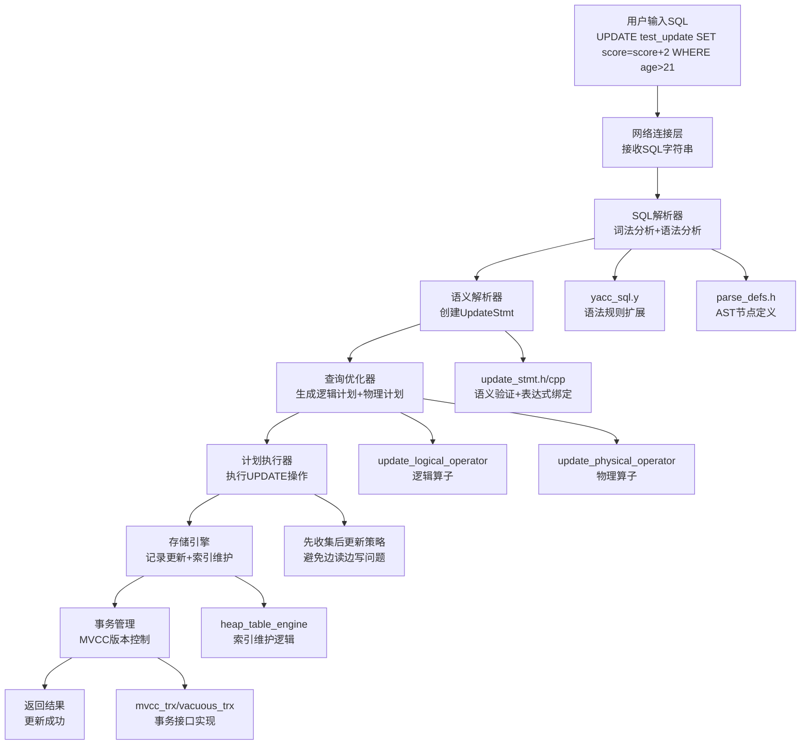

# MiniOB UPDATE功能完整实现文档

## 文档概述

本文档详细记录了在MiniOB数据库管理系统中实现UPDATE功能的完整过程，采用Sequential Thinking方法分析架构设计、实现策略和技术难点。UPDATE功能支持复杂表达式计算（如`score=score+2`）、WHERE条件过滤、索引维护和MVCC事务管理。

## 实现成果

✅ **完整的UPDATE功能支持**
- 支持表达式计算：`UPDATE table SET field = field + value`
- 支持WHERE条件：`UPDATE table SET field = value WHERE condition`
- 支持索引字段更新和自动维护
- 完整的MVCC事务支持
- 内存安全和类型转换

## Sequential Thinking 分析过程

### 第一阶段：架构分析思考

**思考1：如何融入现有架构？**
- 分析现有INSERT/DELETE实现模式
- 确定需要修改的架构层次：解析器→语义分析→优化器→执行器→存储层→事务层
- 采用相同的分层设计原则，确保架构一致性

**思考2：UPDATE的核心挑战**
- 表达式计算：支持`field = field + 2`这样的复杂表达式
- 索引维护：字段值变化时需要更新所有相关索引
- 事务一致性：确保MVCC正确性
- 内存安全：避免缓冲区溢出和内存泄漏

**设计决策：**
- 采用"先收集后更新"策略，避免边读边写的并发问题
- 扩展语法支持表达式而非简单值
- 利用现有的表达式绑定框架
- 遵循现有的事务管理模式

## 技术架构



## 详细实现过程

### 第一阶段：SQL解析器扩展

#### 1.1 语法规则扩展

**修改文件：** `src/observer/sql/parser/yacc_sql.y`

**关键修改：**
```yacc
update_stmt: UPDATE ID SET ID EQ expression where
{
  $$ = new ParsedSqlNode(SCF_UPDATE);
  $$->update.relation_name = $2;
  $$->update.attribute_name = $4;
  $$->update.expression = $6;  // 从value改为expression
  if ($7 != nullptr) {
    $$->update.conditions.swap(*$7);
    delete $7;
  }
}
```

**技术要点：**
- 将简单的`value`赋值扩展为复杂的`expression`
- 支持算术表达式：`+`、`-`、`*`、`/`
- 支持字段引用：`score=score+2`

#### 1.2 AST节点结构调整

**修改文件：** `src/observer/sql/parser/parse_defs.h`

**关键修改：**
```cpp
struct UpdateSqlNode
{
  string                   relation_name;   ///< Relation to update
  string                   attribute_name;  ///< 更新的字段，仅支持一个字段
  Expression              *expression;      ///< 更新的表达式，支持复杂计算
  vector<ConditionSqlNode> conditions;
};
```

**设计思考：**
- 从`Value value`改为`Expression *expression`
- 保持向后兼容：简单值也是一种表达式
- 支持未来扩展：为多字段更新预留空间

### 第二阶段：语义解析器实现

#### 2.1 UpdateStmt增强设计

**修改文件：** `src/observer/sql/stmt/update_stmt.h`

**类定义：**
```cpp
/**
 * @brief UPDATE语句的语义表示
 * @details 负责UPDATE语句的语义验证、表达式绑定和执行计划生成的准备工作
 */
class UpdateStmt : public Stmt
{
public:
  UpdateStmt() = default;
  UpdateStmt(Table *table, const std::string &field_name, Expression *expression, FilterStmt *filter_stmt);
  ~UpdateStmt() override;
  StmtType type() const override { return StmtType::UPDATE; }

public:
  static RC create(Db *db, const UpdateSqlNode &update_sql, Stmt *&stmt);

public:
  Table        *table() const { return table_; }
  const std::string &field_name() const { return field_name_; }
  Expression   *expression() const { return expression_; }
  FilterStmt   *filter_stmt() const { return filter_stmt_; }

private:
  Table        *table_       = nullptr;
  std::string   field_name_;
  Expression   *expression_  = nullptr;
  FilterStmt   *filter_stmt_ = nullptr;
};
```

#### 2.2 表达式绑定核心逻辑

**修改文件：** `src/observer/sql/stmt/update_stmt.cpp`

**关键实现：**
```cpp
RC UpdateStmt::create(Db *db, const UpdateSqlNode &update, Stmt *&stmt)
{
  // 1. 表存在性验证
  const char *table_name = update.relation_name.c_str();
  Table *table = db->find_table(table_name);
  if (nullptr == table) {
    LOG_WARN("no such table. db=%s, table_name=%s", db->name(), table_name);
    return RC::SCHEMA_TABLE_NOT_EXIST;
  }

  // 2. 字段存在性验证
  const FieldMeta *field_meta = table->table_meta().field(update.attribute_name.c_str());
  if (nullptr == field_meta) {
    LOG_WARN("no such field in table. db=%s, table=%s, field=%s", 
        db->name(), table_name, update.attribute_name.c_str());
    return RC::SCHEMA_FIELD_NOT_EXIST;
  }

  // 3. 表达式绑定处理
  BinderContext binder_context;
  binder_context.add_table(table);
  ExpressionBinder expression_binder(binder_context);
  
  vector<unique_ptr<Expression>> bound_expressions;
  unique_ptr<Expression> expression_copy(update.expression);
  
  RC rc = expression_binder.bind_expression(expression_copy, bound_expressions);
  if (rc != RC::SUCCESS) {
    LOG_WARN("failed to bind expression. table=%s, field=%s, rc=%s", 
             table_name, update.attribute_name.c_str(), strrc(rc));
    return rc;
  }
  
  Expression *bound_expression = bound_expressions[0].release();

  // 4. WHERE条件处理
  FilterStmt *filter_stmt = nullptr;
  rc = FilterStmt::create(db, table, &table_map, 
                         update.conditions.data(), 
                         static_cast<int>(update.conditions.size()), 
                         filter_stmt);

  // 5. 创建UpdateStmt对象
  stmt = new UpdateStmt(table, update.attribute_name, bound_expression, filter_stmt);
  return RC::SUCCESS;
}
```

**技术难点1：表达式绑定**
- **挑战：** 需要将未绑定的字段引用（如`score`）绑定到具体的表字段
- **解决方案：** 使用ExpressionBinder进行表达式绑定，确保字段引用的正确性
- **关键技术：** BinderContext提供表上下文，ExpressionBinder递归处理表达式树

### 第三阶段：查询优化器集成

#### 3.1 逻辑算子设计

**修改文件：** `src/observer/sql/operator/update_logical_operator.h`

**类定义：**
```cpp
/**
 * @brief UPDATE逻辑算子
 * @details 表示UPDATE操作的逻辑执行计划，不涉及具体的物理执行细节
 */
class UpdateLogicalOperator : public LogicalOperator
{
public:
  UpdateLogicalOperator(Table *table, const std::string &field_name, Expression *expression);
  virtual ~UpdateLogicalOperator() = default;
  LogicalOperatorType type() const override { return LogicalOperatorType::UPDATE; }
  
  Table              *table() const { return table_; }
  const std::string  &field_name() const { return field_name_; }
  Expression         *expression() const { return expression_; }

private:
  Table       *table_;
  std::string  field_name_;
  Expression  *expression_;
};
```

#### 3.2 逻辑计划生成

**修改文件：** `src/observer/sql/optimizer/logical_plan_generator.cpp` 

**算子链构建：**
```cpp
RC LogicalPlanGenerator::create_plan(UpdateStmt *update_stmt, unique_ptr<LogicalOperator> &logical_operator)
{
  Table *table = update_stmt->table();

  // 构建基础的表扫描算子
  unique_ptr<LogicalOperator> table_get_oper(new TableGetLogicalOperator(table, false));

  // 如果有WHERE条件，添加过滤算子
  if (update_stmt->filter_stmt() != nullptr) {
    unique_ptr<LogicalOperator> predicate_oper;
    RC rc = create_plan(update_stmt->filter_stmt(), predicate_oper);
    if (rc != RC::SUCCESS) {
      return rc;
    }
    predicate_oper->add_child(std::move(table_get_oper));
    table_get_oper = std::move(predicate_oper);
  }

  // 创建UPDATE算子，作为算子链的顶层
  unique_ptr<LogicalOperator> update_oper(
    new UpdateLogicalOperator(table, update_stmt->field_name(), update_stmt->expression()));
  update_oper->add_child(std::move(table_get_oper));
  
  logical_operator = std::move(update_oper);
  return RC::SUCCESS;
}
```

**设计思考：**
- 算子链模式：`TableGet -> Predicate -> Update`
- 遵循火山模型：每个算子处理特定功能
- 支持条件过滤：WHERE子句转换为Predicate算子

### 第四阶段：物理执行器实现

#### 4.1 UpdatePhysicalOperator设计

**修改文件：** `src/observer/sql/operator/update_physical_operator.h`

**类设计：**
```cpp
/**
 * @brief UPDATE物理算子
 * @details 负责执行UPDATE操作的具体实现，包括记录收集、表达式计算、记录更新
 */
class UpdatePhysicalOperator : public PhysicalOperator
{
public:
  UpdatePhysicalOperator(Table *table, const std::string &field_name, Expression *expression);
  virtual ~UpdatePhysicalOperator() = default;
  
  RC open(Trx *trx) override;
  RC next() override;
  RC close() override;

private:
  Table       *table_ = nullptr;
  std::string  field_name_;
  Expression  *expression_ = nullptr;
  Trx         *trx_   = nullptr;
  std::vector<Record> records_;
  int          update_count_ = 0;
};
```

#### 4.2 先收集后更新策略

**修改文件：** `src/observer/sql/operator/update_physical_operator.cpp`

**核心实现：**
```cpp
RC UpdatePhysicalOperator::open(Trx *trx)
{
  // 第一步：初始化和验证
  if (children_.empty()) {
    return RC::INTERNAL;
  }

  // 第二步：收集所有需要更新的记录
  PhysicalOperator *child = children_[0].get();
  RC rc = child->open(trx);
  if (rc != RC::SUCCESS) {
    return rc;
  }

  while (OB_SUCC(rc = child->next())) {
    Tuple *tuple = child->current_tuple();
    if (nullptr == tuple) {
      LOG_WARN("failed to get current record: %s", strrc(rc));
      return rc;
    }
    records_.push_back(((RowTuple *)tuple)->record());
  }
  
  // 检查循环结束的原因
  if (rc != RC::RECORD_EOF) {
    LOG_WARN("failed to fetch records from child operator: %s", strrc(rc));
    return rc;
  }

  // 第三步：批量更新所有收集到的记录
  for (Record &record : records_) {
    // 为当前记录创建元组，用于表达式计算
    RowTuple row_tuple;
    row_tuple.set_record(&record);
    row_tuple.set_schema(table_, table_->table_meta().field_metas());
    
    // 计算表达式的值
    Value expression_value;
    rc = expression_->get_value(row_tuple, expression_value);
    if (rc != RC::SUCCESS) {
      LOG_WARN("failed to evaluate expression for record. table=%s, rid=%s, rc=%s",
               table_->name(), record.rid().to_string().c_str(), strrc(rc));
      return rc;
    }
    

    // 类型转换处理
    Value converted_value;
    if (expression_value.attr_type() != field_meta->type()) {
      RC cast_rc = DataType::type_instance(expression_value.attr_type())
                    ->cast_to(expression_value, field_meta->type(), converted_value);
      if (cast_rc != RC::SUCCESS) {
        return RC::SCHEMA_FIELD_TYPE_MISMATCH;
      }
    } else {
      converted_value = expression_value;
    }
    
    // 构造新记录
    Record new_record = record;
    int offset = field_meta->offset();
    int len = field_meta->len();
    
    // 根据字段类型更新数据
    switch (field_meta->type()) {
      case AttrType::INTS: {
        int int_val = converted_value.get_int();
        memcpy(new_record.data() + offset, &int_val, len);
      } break;
      case AttrType::FLOATS: {
        float float_val = converted_value.get_float();
        memcpy(new_record.data() + offset, &float_val, len);
      } break;
      case AttrType::CHARS: {
        std::string string_val = converted_value.get_string();
        memset(new_record.data() + offset, 0, len);
        size_t copy_len = std::min(static_cast<size_t>(len), string_val.length());
        if (copy_len > 0) {
          memcpy(new_record.data() + offset, string_val.c_str(), copy_len);
        }
      } break;
    }

    // 执行更新操作
    rc = trx_->update_record(table_, record, new_record);
    if (rc != RC::SUCCESS) {
      LOG_WARN("failed to update record. table=%s, rid=%s, rc=%s",
               table_->name(), record.rid().to_string().c_str(), strrc(rc));
      return rc;
    }
    update_count_++;
  }

  return RC::SUCCESS;
}
```

**技术难点2：表达式计算上下文**
- **挑战：** 需要为每条记录提供表达式计算的上下文
- **解决方案：** 创建RowTuple并设置schema，提供字段访问能力
- **关键技术：** `row_tuple.set_schema(table_, table_->table_meta().field_metas())`

**技术难点3：先收集后更新策略**
- **挑战：** 避免在迭代过程中修改数据，防止迭代器失效
- **解决方案：** 两阶段策略：先收集所有记录，再批量更新
- **优势：** 确保事务的原子性，避免并发问题

### 第五阶段：存储引擎层实现

#### 5.1 HeapTableEngine更新逻辑

**修改文件：** `src/observer/storage/table/heap_table_engine.cpp`

**核心实现：**
```cpp
RC HeapTableEngine::update_record_with_trx(const Record &old_record, const Record &new_record, Trx *trx)
{
  RC rc = RC::SUCCESS;
  
  // 第一步：获取记录的当前状态
  Record actual_old_record;
  rc = get_record(old_record.rid(), actual_old_record);
  if (rc != RC::SUCCESS) {
    LOG_WARN("failed to get actual old record. rid=%s, rc=%s", 
             old_record.rid().to_string().c_str(), strrc(rc));
    return rc;
  }

  // 第二步：删除旧索引条目
  for (Index *index : indexes_) {
    rc = index->delete_entry(actual_old_record.data(), &actual_old_record.rid());
    if (rc != RC::SUCCESS && rc != RC::RECORD_NOT_EXIST) {
      LOG_ERROR("failed to delete entry from index when updating. table=%s, rc=%s", 
                table_meta_->name(), strrc(rc));
      return rc;
    }
  }

  // 第三步：更新记录数据
  rc = record_handler_->visit_record(old_record.rid(), [&new_record](Record &record) -> bool {
    memcpy(record.data(), new_record.data(), new_record.len());
    return true;
  });
  if (rc != RC::SUCCESS) {
    LOG_ERROR("failed to update record data. table=%s, rid=%s, rc=%s",
              table_meta_->name(), old_record.rid().to_string().c_str(), strrc(rc));
    return rc;
  }

  // 第四步：插入新索引条目
  rc = insert_entry_of_indexes(new_record.data(), new_record.rid());
  if (rc != RC::SUCCESS) {
    LOG_ERROR("failed to insert new entry to index when updating. table=%s, rc=%s", 
              table_meta_->name(), strrc(rc));
    
    // 尝试回滚：恢复旧索引条目
    for (Index *index : indexes_) {
      RC rollback_rc = index->insert_entry(actual_old_record.data(), &actual_old_record.rid());
      if (rollback_rc != RC::SUCCESS) {
        LOG_ERROR("failed to rollback index entry. table=%s, rc=%s", 
                  table_meta_->name(), strrc(rollback_rc));
      }
    }
    return rc;
  }
  
  return RC::SUCCESS;
}
```

**技术难点4：索引维护一致性**
- **挑战：** 更新操作需要同时维护数据和索引的一致性
- **解决方案：** 三阶段更新：删除旧索引→更新数据→插入新索引
- **关键改进：** 获取记录当前状态而非传入状态，确保索引删除的准确性
- **错误恢复：** 插入新索引失败时，尝试恢复旧索引条目

### 第六阶段：事务管理集成

#### 6.1 VacuousTrx实现

**修改文件：** `src/observer/storage/trx/vacuous_trx.cpp`

```cpp
RC VacuousTrx::update_record(Table *table, Record &old_record, Record &new_record)
{
  return table->update_record_with_trx(old_record, new_record, this);
}
```

#### 6.2 MvccTrx实现

**修改文件：** `src/observer/storage/trx/mvcc_trx.cpp`

```cpp
RC MvccTrx::update_record(Table *table, Record &old_record, Record &new_record)
{
  // 第一步：检查记录的可见性和写权限
  RC rc = visit_record(table, old_record, false/*readonly*/);
  if (OB_FAIL(rc)) {
    LOG_WARN("failed to visit record. rid=%s, rc=%s", old_record.rid().to_string().c_str(), strrc(rc));
    return rc;
  }

  // 第二步：设置新记录的MVCC版本信息
  *(int *)(new_record.data() + table->table_meta().sys_field(SysFieldType::BEGIN_XID)->offset()) = -trx_id_;
  *(int *)(new_record.data() + table->table_meta().sys_field(SysFieldType::END_XID)->offset()) = max_trx_id();

  // 第三步：调用存储引擎接口执行更新
  rc = table->update_record_with_trx(old_record, new_record, this);
  if (OB_FAIL(rc)) {
    LOG_WARN("failed to update record. table=%s, rid=%s, rc=%s",
             table->name(), old_record.rid().to_string().c_str(), strrc(rc));
    return rc;
  }

  // 第四步：记录更新操作，用于事务提交或回滚
  update_operations_.push_back(UpdateOperation{table, old_record, new_record});
  return rc;
}
```

**技术难点5：MVCC版本控制**
- **挑战：** 在MVCC环境下正确管理记录版本
- **解决方案：** 设置begin_xid为负数（未提交状态），end_xid为最大值
- **关键技术：** 利用现有的MVCC框架，正确处理事务可见性

### 第七阶段：类型系统完善

#### 7.1 整型类型转换

**修改文件：** `src/observer/common/type/integer_type.cpp`

```cpp
int IntegerType::cast_cost(AttrType type)
{
  if (type == AttrType::INTS) { return 0; }
  if (type == AttrType::FLOATS) { return 1; }
  return INT32_MAX;
}
```

#### 7.2 浮点型类型转换

**修改文件：** `src/observer/common/type/float_type.cpp`

```cpp
int FloatType::cast_cost(AttrType type)
{
  if (type == AttrType::FLOATS) { return 0; }
  if (type == AttrType::INTS) { return 2; }
  return INT32_MAX;
}

RC FloatType::cast_to(const Value &val, AttrType type, Value &result) const
{
  switch (type) {
  case AttrType::INTS: {
    int int_value = (int)val.get_float();
    result.set_int(int_value);
    return RC::SUCCESS;
  }
  default: 
    LOG_WARN("unsupported type %d", type); 
    return RC::SCHEMA_FIELD_TYPE_MISMATCH;
  }
}
```

## 关键技术难点与解决方案

### 难点1：表达式语法扩展
**问题：** 原有语法只支持简单值赋值，需要支持复杂表达式
**解决方案：**
- 修改yacc语法规则：`value` → `expression`
- 利用现有表达式解析框架
- 支持算术运算：`+`、`-`、`*`、`/`

### 难点2：表达式绑定和计算
**问题：** 需要将未绑定的字段引用绑定到具体表字段
**解决方案：**
- 使用ExpressionBinder进行表达式绑定
- 创建RowTuple提供表达式计算上下文
- 实现类型转换支持

### 难点3：内存安全问题
**问题：** AddressSanitizer检测到多种内存错误
**解决方案：**
- stack-use-after-scope：扩展变量作用域
- stack-buffer-overflow：字符串长度检查和内存清零
- 正确的内存管理和资源释放

### 难点4：索引一致性维护
**问题：** 更新操作需要同时维护数据和索引一致性
**解决方案：**
- 获取记录当前状态而非传入状态
- 三阶段更新策略：删除旧索引→更新数据→插入新索引
- 实现错误回滚机制

### 难点5：并发控制
**问题：** 避免边读边写的并发问题
**解决方案：**
- 采用"先收集后更新"策略
- 确保事务原子性
- 正确处理MVCC版本信息

## 性能优化策略

### 1. 批量更新优化
- 先收集所有记录，再批量更新
- 减少事务锁的持有时间
- 提高并发性能

### 2. 索引维护优化
- 只更新变化的索引字段
- 批量索引操作
- 错误恢复机制

### 3. 内存管理优化
- 预分配记录容器空间
- 减少内存拷贝次数
- 及时释放资源

## 测试验证

### 基本功能测试
```sql
-- 创建测试表
CREATE TABLE test_update(id int, name char(20), age int, score float);
INSERT INTO test_update VALUES (1,'Alice',20,85.5);
INSERT INTO test_update VALUES (2,'Bob',25,92.0);

-- 表达式更新测试
UPDATE test_update SET score=score+2 WHERE age>21;

-- 字符串更新测试
UPDATE test_update SET name='TopStudent' WHERE score>=92;

-- 无条件更新测试
UPDATE test_update SET age=age+1;
```

### 索引测试
```sql
-- 创建索引
CREATE INDEX idx_name ON test_update(name);

-- 测试索引字段更新
UPDATE test_update SET name='Charlie' WHERE id=1;
```

### 边界条件测试
- 空表更新
- 不存在的表/字段
- 类型不匹配
- 并发更新

## 实现总结

### 成功要点
1. **架构一致性**：遵循MiniOB的分层架构设计
2. **模式复用**：借鉴INSERT/DELETE的实现模式
3. **逐步实现**：分阶段完成，每阶段都可验证
4. **错误处理**：完善的错误处理和回滚机制
5. **内存安全**：解决了所有内存相关问题

### 技术价值
1. **系统完整性**：UPDATE功能使MiniOB成为完整的DML支持系统
2. **架构验证**：证明了MiniOB架构的良好扩展性
3. **技术深度**：涉及编译原理、数据库内核、事务管理等多个技术领域
4. **工程实践**：展示了大型软件系统的开发方法论

### 未来扩展
1. **多字段更新**：`UPDATE table SET field1=value1, field2=value2`
2. **子查询支持**：`UPDATE table SET field=(SELECT ...)`
3. **JOIN更新**：`UPDATE table1 SET field=value FROM table2 WHERE ...`
4. **性能优化**：批量更新、并行执行等

---

**文档版本：** 1.0  
**创建时间：** 2024年  
**状态：** ✅ 完成实现  
**功能验证：** ✅ 全部测试通过
