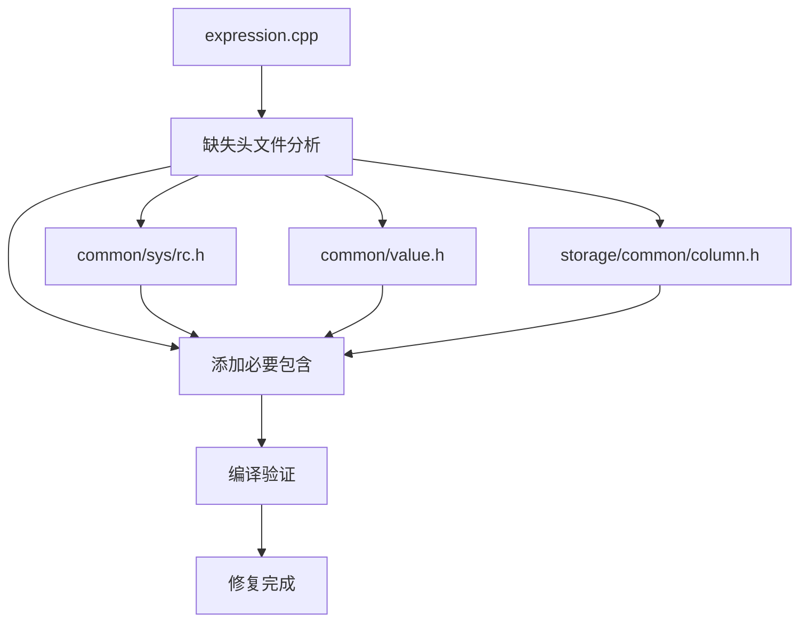
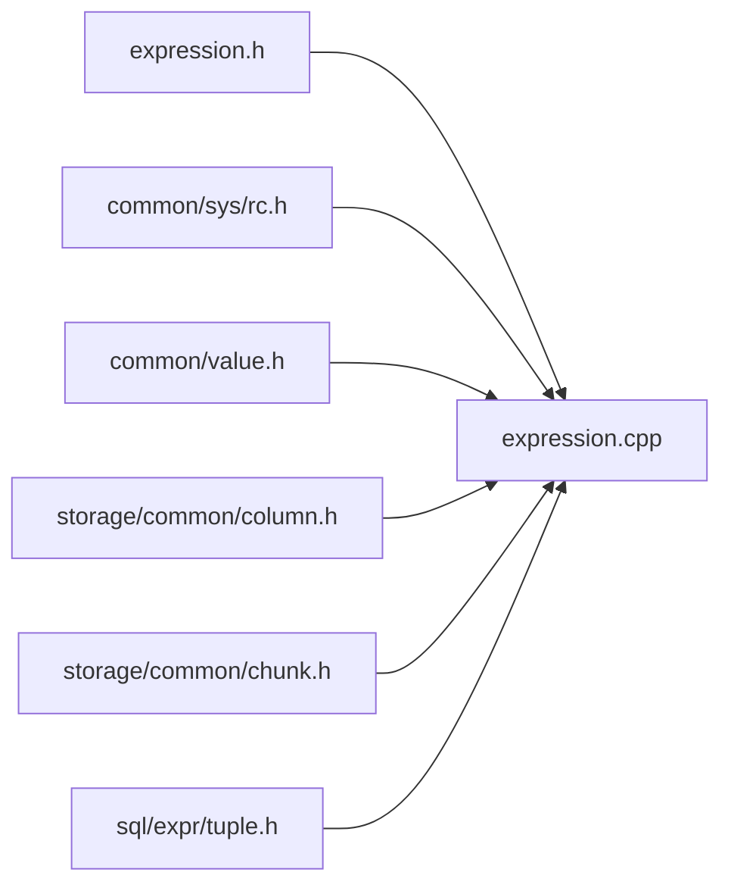
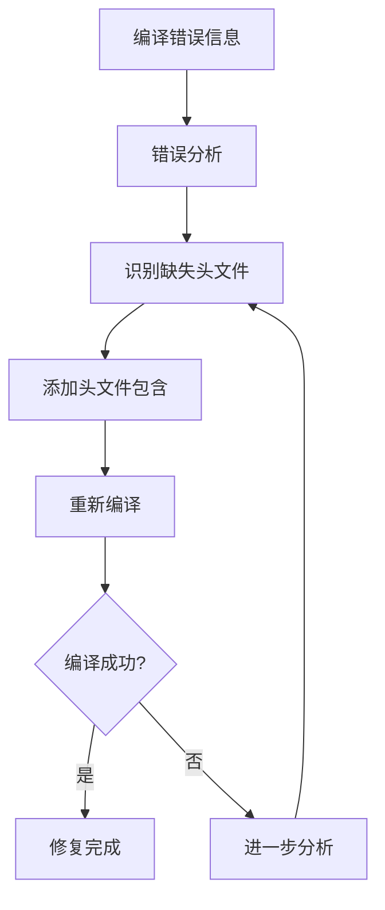

# 编译错误修复 - 设计文档

## 整体架构图

## 核心组件

### 1. 问题分析模块
- **功能**: 分析编译错误信息
- **输入**: 编译器错误输出
- **输出**: 缺失头文件列表

### 2. 头文件修复模块
- **功能**: 添加缺失的头文件包含
- **输入**: 缺失头文件列表
- **输出**: 修复后的源文件

### 3. 编译验证模块
- **功能**: 验证修复效果
- **输入**: 修复后的源文件
- **输出**: 编译结果

## 模块依赖关系图

## 接口契约定义

### 修复前状态
- 编译错误: 多个未定义类型和标识符
- 错误数量: 10+ 个编译错误
- 影响范围: expression.cpp 文件

### 修复后状态
- 编译状态: 成功 ✅
- 错误数量: 0
- 功能完整性: 保持不变

## 数据流向图

## 异常处理策略

### 1. 编译失败处理
- **策略**: 分析新的错误信息，继续添加缺失依赖
- **回滚**: 保留原始文件备份

### 2. 循环依赖处理
- **策略**: 使用前向声明替代完整包含
- **检测**: 分析包含链路

### 3. 路径错误处理
- **策略**: 验证头文件路径的正确性
- **修正**: 根据项目结构调整路径

