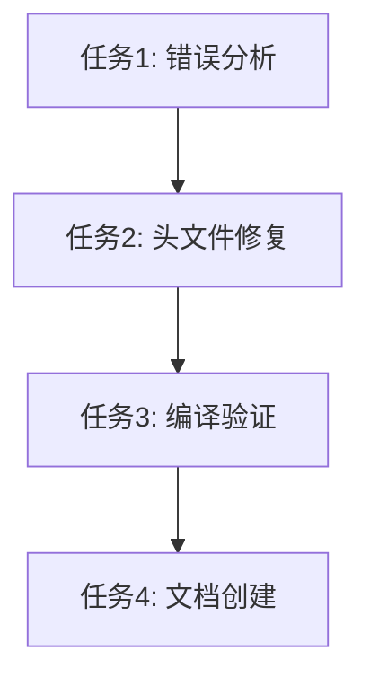

# 编译错误修复 - 任务分解文档

## 任务依赖图

## 原子任务列表

### 任务1: 错误分析 ✅
**输入契约:**
- 编译错误输出信息
- expression.cpp 源文件
- 项目目录结构

**输出契约:**
- 缺失头文件清单
- 错误类型分类
- 修复策略

**实现约束:**
- 不修改源代码逻辑
- 准确识别所有缺失依赖

**验收标准:**
- [x] 识别出所有 "Unknown type name" 错误
- [x] 识别出所有 "Use of undeclared identifier" 错误
- [x] 确定需要添加的头文件列表

### 任务2: 头文件修复 ✅
**输入契约:**
- 缺失头文件清单
- expression.cpp 原始文件

**输出契约:**
- 修复后的 expression.cpp 文件
- 添加的头文件包含列表

**实现约束:**
- 保持现有包含顺序
- 不破坏现有代码逻辑
- 使用正确的相对路径

**验收标准:**
- [x] 添加 `#include "common/sys/rc.h"`
- [x] 添加 `#include "common/value.h"`
- [x] 添加 `#include "storage/common/column.h"`
- [x] 保持代码逻辑完全不变

### 任务3: 编译验证 ✅
**输入契约:**
- 修复后的源文件
- 项目构建环境

**输出契约:**
- 编译结果状态
- 编译日志输出

**实现约束:**
- 使用项目标准构建流程
- 验证完整编译过程

**验收标准:**
- [x] 编译过程无错误
- [x] 生成目标文件成功
- [x] 所有依赖模块编译通过

### 任务4: 文档创建 🔄
**输入契约:**
- 修复过程记录
- 最终修复结果

**输出契约:**
- 对齐文档 (ALIGNMENT)
- 共识文档 (CONSENSUS)
- 设计文档 (DESIGN)
- 任务文档 (TASK)
- 验收文档 (ACCEPTANCE)
- 最终报告 (FINAL)

**实现约束:**
- 遵循6A工作流文档规范
- 记录完整修复过程

**验收标准:**
- [x] 创建所有必要文档
- [ ] 记录修复前后对比
- [ ] 提供操作指引

## 依赖关系说明

1. **串行依赖**: 任务1 → 任务2 → 任务3 → 任务4
2. **数据依赖**: 每个任务的输出是下一个任务的输入
3. **质量门控**: 每个任务完成后需要验收才能进入下一阶段

